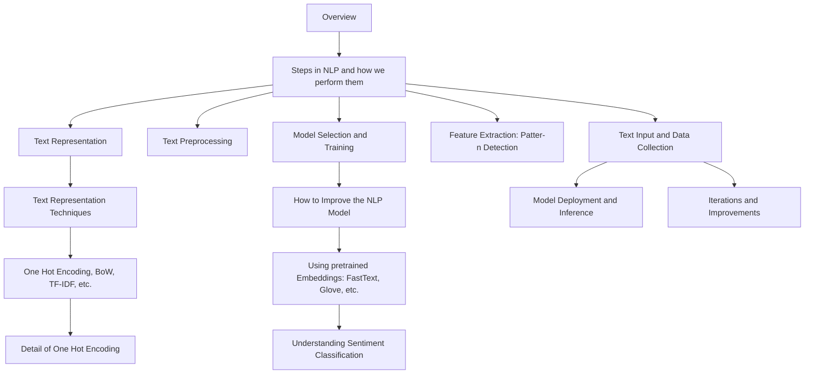
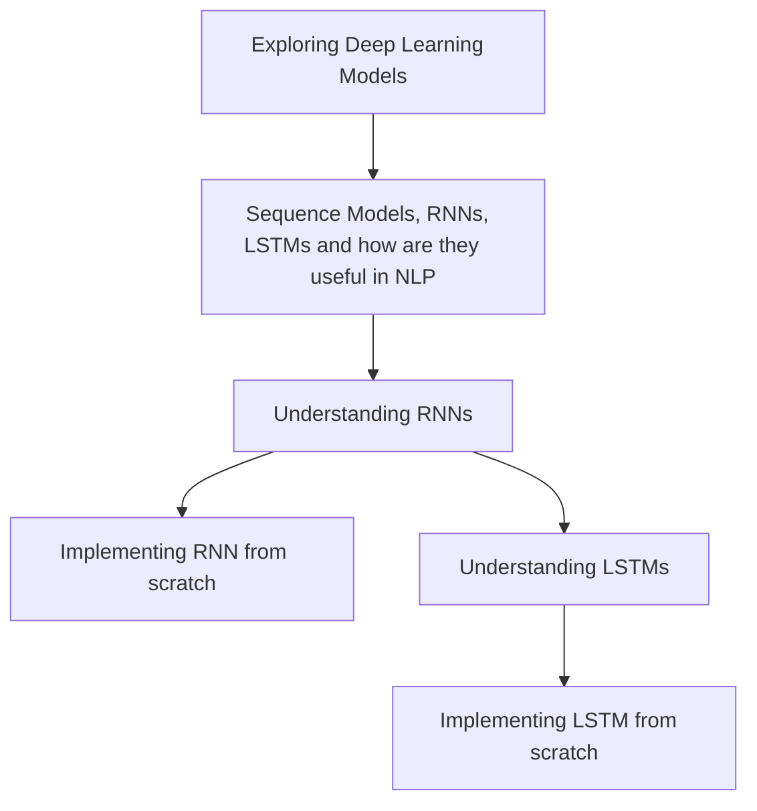
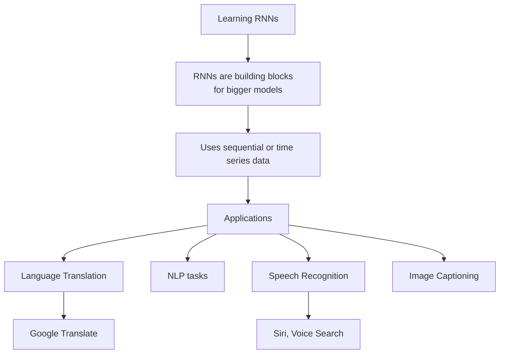
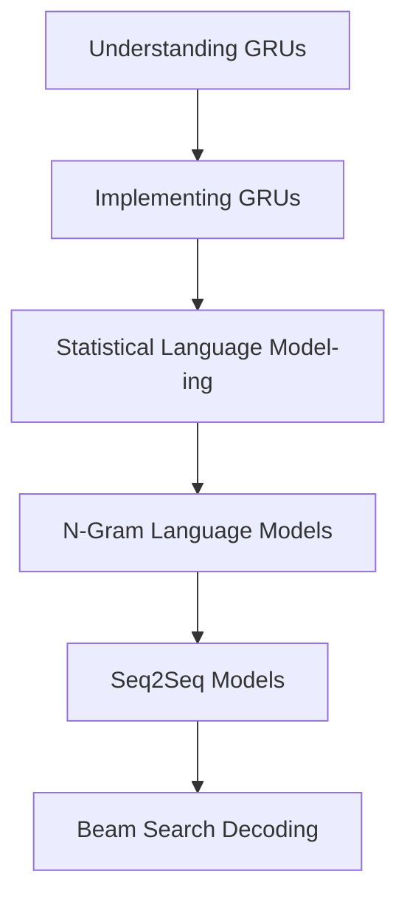
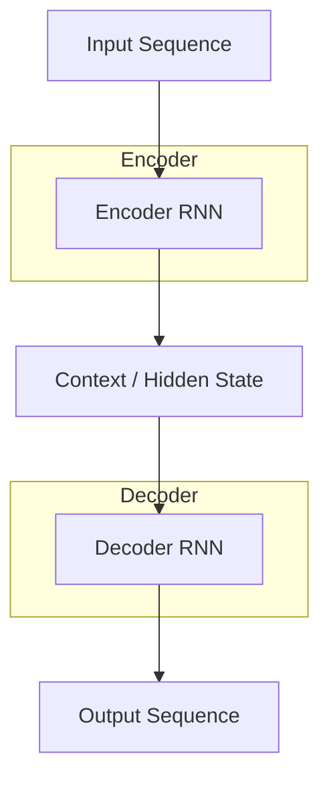
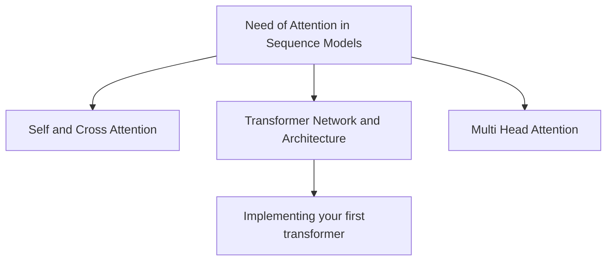
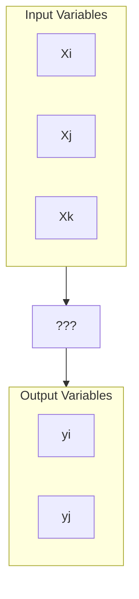
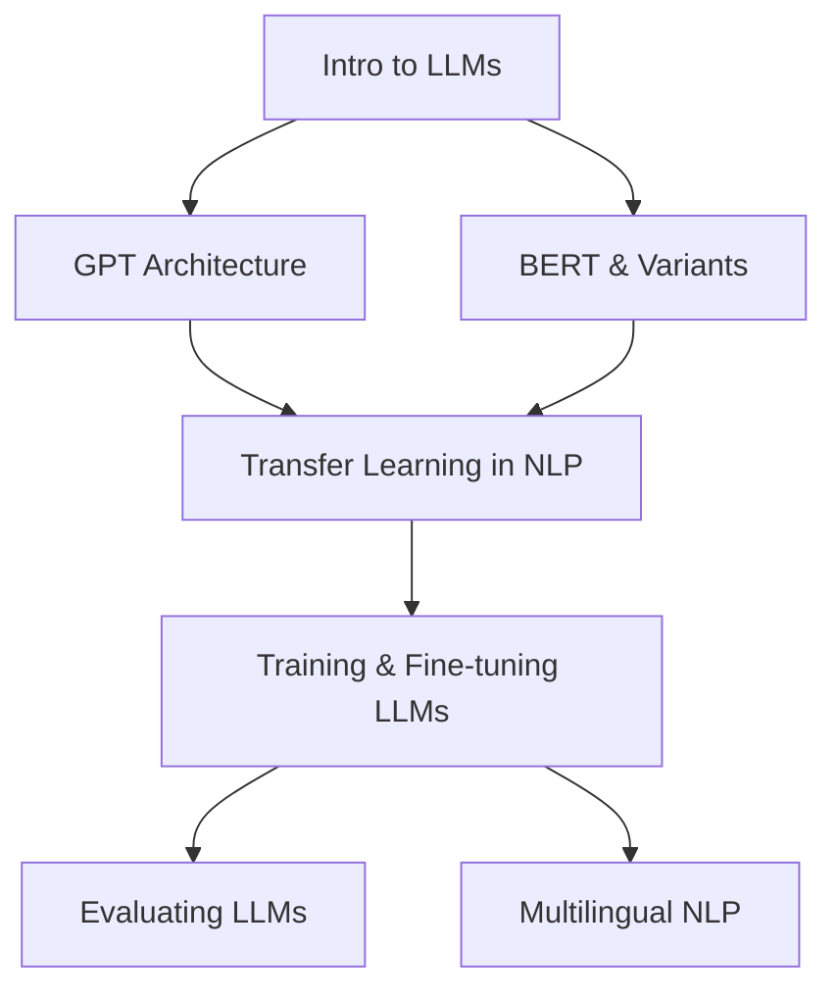

# Motivation

Welcome to the Natural Language Processing Roadmap <<>>

This roadmap is your hands-on, no-fluff guide to mastering NLP—from basic text processing to implementing actual working code. Over 9 structured weeks, you'll progressively unlock NLP's core concepts through carefully designed content, practical mini assignments, and real-world projects. While challenging, everything here is absolutely achievable with consistent effort and curiosity.

**Flexible Structure (Highly Recommended but Not Rigid)**

We've arranged topics in a logical progression, especially for the first few weeks where NLP techniques form the critical foundation. 

Timing is flexible too. Some days, you’ll binge a week’s content in one sitting; other times, a single concept might take days to click. Both are normal! The key is to keep moving forward without burning out. Enjoy the journey—NLP is as much art as it is science . 

# Background

Machine Learning primarily deals with structured datasets—numbers, tables, and well-organized records that can be fed into algorithms.

But what if we want to analyze something more complex? For example, suppose we want to assess a company’s market status by understanding its recent news articles, press releases, or social media updates. These are written in natural language, which is messy, ambiguous, and heavily dependent on context.

This raises the question: How can machines make sense of language—the way humans naturally communicate?

The answer lies in Natural Language Processing (NLP), a subfield of AI that enables machines to process, understand, and generate human language. Through NLP techniques such as text preprocessing, embeddings, sentiment analysis, and language models, we can extract insights from unstructured text data, allowing applications like:

- Market sentiment analysis
- News classification
- Trend detection
- Automated summarization of financial reports

Thus, NLP bridges the gap between raw human language and structured machine understanding, enabling Machine Learning to be applied meaningfully to text-based problems.

# Meta-Summary

This roadmap begins with the foundations of text preprocessing and representation, where we learn to clean, normalize, and encode text using techniques like Bag-of-Words, TF-IDF, one-hot encoding, and word embeddings, eventually leveraging pretrained embeddings for tasks such as sentiment classification. From there, we move into sequence models, starting with RNNs and LSTMs, implementing them from scratch, and then extending to GRUs and statistical language modeling with n-grams, Seq2Seq, and beam search decoding. 

Building on this, we introduce attention mechanisms—self-attention, multi-head attention, and scaled dot-product attention—leading to the implementation of a basic Transformer and a deeper exploration of encoder-decoder, encoder-only, and decoder-only architectures. With this foundation, the roadmap transitions into Large Language Models (LLMs), covering their design, visualization, transfer learning, fine-tuning, evaluation, and multilingual applications, followed by advanced reinforcement learning techniques for LLMs such as RLHF, DPO, and multi-agent reinforcement learning. 

Finally, we expand into speech and multimodal NLP, where we explore text-to-speech pipelines, neural vocoders, automatic speech recognition (ASR) with models like Whisper and wav2vec, and emerging cross-modal NLP trends, concluding with hands-on projects in TTS, ASR, and multimodal applications.

Remember , small efforts everyday culminate in making a huge impact. Hence don't feel too overwhelmed by the length of this roadmap . Go day by day and step by step, and you'll find your knowledge growing immensely.


## RoadMap Skeleton

 <details><summary> <strong>Week 1: Text Preprocessing and Embedding Techniques</strong></summary>
    
- [Day1: Overview](#week1day1)
- [Day2: Text Preprocessing, Normalization, Regular Expressions, and Edit Distance](#week1day2)
- [Day3: Diving into Text Representation Techniques(BoW,TF-IDF,CBoW)
](#week1day3)
- [Day4: Diving into One-Hot Encoding and Word Embeddings](#week1day4)
- [Day5: Unlocking the Power of Pretrained Embeddings](#week1day5)
- [Day6: Understanding Sentiment Classification](#week1day6)
- [Day7: Mini-Projects](#week1day7)
    
</details>
<details> <summary><strong>Week 2: RNNs, LSTMs and Sequence Modeling</strong></summary>

- [Day1&2: Understanding RNNs](#week2day1)
- [Day3: Implementing RNNs from scratch](#week2day3)
- [Day4&5: Understanding LSTMs
](#week2day4)
- [Day6: Implementing LSTMs from scratch ](#week2day6)
- [Day7: RNNs and LSTMs veriations](#week2day7)

</details>
<details> <summary><strong>Week 3: GRUs and Language Modelling</strong></summary>
    
- [Day1 and 2 : Understanding GRUs](#week3day1)
- [Day2: Implementing GRUs](#week3day2)
- [Day3: Statistical Language Modeling
](#week3day3)
- [Day4&5: N-Gram Language Models](#week3day4)
- [Day6: Seq2Seq](#week3day6)
- [Day7: Beam Search decoding  ](#week3day7)
</details>
<details> <summary><strong>Week 4: Attention like that of transformers </strong></summary>

- [Day1: Why we need attention and how does it work?](#week4day1)
- [Day2: Self Attention](#week4day2)
- [Day3: Multi head attention
](#week4day3)
- [Day4: Attention Calculation using Scaled Dot Product](#week4day4)
- [Day5:Transformer Network](#week4day5)
- [Day6&7: Implementing your 1st transformer](#week4day6)

</details>

<details><summary> <strong>Week 5: Deep dive into Transformer Models and Intro to LLMs</strong></summary>
    
- [Day1: What do Transformers do ?](#week5day1)
- [Day2: Encoder Decoder Models](#week5day2)
- [Day3: Encoder Only models](#week5day3)
- [Day4: Decoder only models
](#week5day4)
- [Day5: Comparing architectures ](#week5day5)
- [Day6: Optimization on base transformers](#week5day6)
    
</details>
<details> <summary><strong>Week 6: Large Language Models (LLMs) and Fine-Tuning</strong></summary>

- [Day1: Introduction to LLMs](#week6day1)
- [Day2: Understanding, Visualizing and Building LLMs](#week6day2)
- [Day3: Transfer Learning in NLP
](#week6day3)
- [Day4&5: Training and Fine Tuning LLMs](#week6day4)
- [Day6: Evaluating LLMs](#week6day6)
- [Day7: Multilingual NLP – Breaking Language Barriers](#week6day7)

</details>

<details> 
  <summary><strong>Week 7: Advanced Reinforcement Learning Techniques for NLP & Large Language Models</strong></summary>

- [Day1: RLHF & RLAIF](#week7day1)
- [Day2: GRFO and efficient RL fine tuning](#week7day2)
- [Day3: Direct Preference Optimization (DPO) and Reward Densification
](#week7day3)
- [Day4: Hierarchical and Multi-Turn RL for LLMs](#week7day4)
- [Day5: Multi-Agent and Cooperative RL for Language Models](#week7day5)
- [Day6: Reasoning Expansion, Prolonged RL, and the Future of RL for NLP](#week7day6)

</details>


<details> <summary><strong>Week 8: Speech and Multimodal NLP</strong></summary>

- [Day1:  Introduction to Speech & Multimodality](#week8day1)
- [Day2: TTS – Text Analysis Module](#week8day2)
- [Day3: TTS – Spectogram Generation
](#week8day3)
- [Day4: TTS – Neural Vocoders](#week8day4)
- [Day5: latest Trends in TTS](#week8day5)
- [Day6&7: Mini Project – Build a TTS Pipeline](#week8day6)
</details>

<details><summary> <strong>Week 9 : Speech-to-Text & Cross-Modal NLP</strong></summary>
    
- [Day1: Introduction to ASR](#week9day1)
- [Day2&3: Whisper and wav2vec – Multilingual ASR](#week9day2)
- [Day4: Deep Learning Approaches + Comparing ASR Models
](#week9day4)
- [Day5: Cross model NLP trends](#week9day5)
- [Day6: Multimodel Architecture and APIs](#week9day6)
- [Day7: Mini Project – ASR or Cross-Modal App](#week9day7)
    
</details>
    
---
<a id="week1"></a>
# 🦝 Week 1: NLP Intro Pack and Sentiments



## 👾<span id="week1day1">Day 1: Overview</span>
First of all, check out this amazing playlist by TensorFlow to get a crisp idea of what we are going to do this week. It’s packed with insightful videos that will lay a solid foundation for your NLP journey!

[YouTube Link](https://www.youtube.com/playlist?list=PLQY2H8rRoyvzDbLUZkbudP-MFQZwNmU4S)

<a id="week1day2"></a>
## 👾 Day 2: Kickstarting with Text Preprocessing, Normalization, Regular Expressions, and Edit Distance

Concisely speaking , the topics above play the role of Data Sanitization, and are hence extremely important to study NLP. Lets dive deeper below :

#### a. Text Preprocessing: The Foundation of NLP
Imagine trying to read a messy, smudged book – not fun, right? Text preprocessing is like cleaning up that book, making it crisp and readable. It transforms chaotic, noisy text into a tidy format that’s ready for analysis. This process is crucial because cleaner data leads to better NLP model performance!

 Explore More:
Dive deeper into text preprocessing [here](https://ayselaydin.medium.com/1-text-preprocessing-techniques-for-nlp-37544483c007).

#### b. Text Normalization: Streamlining Your Data
Think of text normalization as decluttering your digital workspace. It standardizes text, eliminating noise and focusing on the essence. This involves steps like converting text to lowercase, removing punctuation, and applying techniques like lemmatization and stemming. Essentially, it’s text preprocessing on steroids!

 Discover the Magic of Normalization:
Learn more about normalization [here](https://towardsdatascience.com/text-normalization-7ecc8e084e31/)

#### c. Regular Expressions: Your Pattern Detective
Regular expressions (regex) are like the ultimate search-and-replace tool, but on steroids! They help you find patterns in text – imagine being able to pinpoint every email address or phone number in a document with a simple command.

Check out this blog on regex [here](https://www.analyticsvidhya.com/blog/2021/03/beginners-guide-to-regular-expressions-in-natural-language-processing/)

#### d. Edit Distance: Measuring Textual Similarity
Ever wondered how similar two strings are? Edit distance, specifically Levenshtein distance, tells you the minimum number of edits (insertions, deletions, substitutions) needed to transform one string into another. It’s like calculating the steps to turn “kitten” into “sitting.”

 Get Detailed Insight:
Learn more about edit distance [here](https://medium.com/@_ektagarg/what-is-edit-distance-levenshtein-distance-e4373d8adb3c)


<a id="week1day3"></a>
## 👾 Day 3: Diving into Text Representation Techniques(BoW,TF-IDF,CBoW)
a. **Bag of Words (BoW)**: The Basic Building Block
Imagine reducing a sentence to a simple bag of words, ignoring grammar and order. BoW does just that, focusing on the presence of words. It’s a straightforward way to tokenize text but doesn’t capture context.

Understand BoW:
Explore the concept of Bag of Words [here](https://ayselaydin.medium.com/4-bag-of-words-model-in-nlp-434cb38cdd1b)

b. **TF-IDF**: Adding Depth to Word Representation
TF-IDF adds a twist to BoW by weighing terms based on their importance. It highlights significant words while downplaying common ones. TF (Term Frequency) measures how often a word appears in a document, while IDF (Inverse Document Frequency) gauges the word’s rarity across documents.

Formula Breakdown:

###  Term Frequency - Inverse Document Frequency (TF-IDF) Formulas

**Term Frequency (TF):**

$$
TF(t, d) = \frac{\text{Number of times term } t \text{ appears in document } d}{\text{Total number of terms in document } d}
$$

---

**Inverse Document Frequency (IDF):**

$$
IDF(t, D) = \log \left( \frac{\text{Total number of documents}}{\text{Number of documents containing the term } t} \right)
$$

---

**TF-IDF Score:**

$$
TF\text{-}IDF(t, d, D) = TF(t, d) \times IDF(t, D)
$$
Explore More:
Get a detailed understanding of TF-IDF [here.](https://www.learndatasci.com/glossary/tf-idf-term-frequency-inverse-document-frequency/#:~:text=Term%20Frequency%20%2D%20Inverse%20Document%20Frequency%20(TF%2DIDF)%20is,%2C%20relative%20to%20a%20corpus)

#### c. Continuous Bag of Words (CBOW): Contextual Word Embeddings
CBOW is part of the Word2Vec family, predicting a target word based on its context. It’s like filling in the blanks in a sentence using surrounding words, capturing semantic relationships.

How It Works: For the sentence “The quick brown fox jumps over the lazy dog” and the target word “fox,” CBOW uses the context (“The,” “quick,” “jumps,” “over”) to predict “fox.”

Discover CBOW:
Learn more about Continuous Bag of Words [here.](https://www.geeksforgeeks.org/nlp/continuous-bag-of-words-cbow-in-nlp/)

<a id="week1day4"></a>
## 👾 Day 4: Diving into One-Hot Encoding and Word Embeddings
#### a. One-Hot Encoding: The Basic Building Block of NLP
Imagine trying to categorize a group of objects where each object belongs to a unique category. One-hot encoding is like assigning a unique ID card to each word in your text, where each card contains just one slot marked “1” and all other slots marked “0.” This approach transforms words into a format that machines can understand and process.

##### How It Works: 
Each word is represented as a vector with a length equal to the total number of unique words (vocabulary size). In this vector, only one element is “hot” (set to 1), and the rest are “cold” (set to 0).
Example: For a vocabulary of [‘apple’, ‘banana’, ‘cherry’]:
‘apple’ → [1, 0, 0]
‘banana’ → [0, 1, 0]
‘cherry’ → [0, 0, 1]
Explore More: Learn more about one-hot encoding [here.](https://www.geeksforgeeks.org/machine-learning/ml-one-hot-encoding/)

#### b. Word Embeddings: Adding Depth to Word Representations
You shall know a word by the company it keeps — J.R. Firth
While one-hot encoding is simple, it doesn’t capture the relationships or meanings of words. Enter word embeddings – a more sophisticated approach where words are represented as dense vectors in a continuous vector space. These vectors are learned from the text data itself, capturing semantic relationships and similarities between words.

##### How It Works: 
Word embeddings are created using algorithms like Word2Vec, GloVe, or FastText. Each word is mapped to a vector of fixed size (e.g., 100 dimensions) where similar words have similar vectors.
Example: For the words ‘king’, ‘queen’, ‘man’, and ‘woman’, word embeddings might capture the relationships like:
‘king’ - ‘man’ + ‘woman’ ≈ ‘queen’
‘man’ and ‘woman’ will be closer to each other in the vector space than ‘man’ and ‘banana’.
Explore More: Dive deeper into word embeddings [here.](https://www.ibm.com/think/topics/word-embeddings)


<a id="week1day5"></a>
## 👾 Day 5: Unlocking the Power of Pretrained Embeddings
#### a. Pretrained Embeddings: Supercharging NLP with Pre-trained Knowledge
Think of pretrained embeddings as getting a head start in a race. Instead of starting from scratch, you leverage the knowledge already learned from massive text corpora. This can significantly boost your NLP models’ performance by providing rich, contextual word representations right out of the box.

##### How It Works:
Pretrained embeddings, such as those from Word2Vec, GloVe, and FastText, are trained on large datasets like Wikipedia or Common Crawl. These embeddings capture nuanced word meanings and relationships, offering a robust foundation for various NLP tasks.
Benefits:
**Efficiency**: Saves time and computational resources since the heavy lifting of training embeddings has already been done.
**Performance**: Often leads to better model performance due to the high-quality, contextual word representations.
**Transfer Learning**: Facilitates transfer learning, where knowledge from one task (like language modeling) can be applied to another (like sentiment analysis).
#### b. Popular Pretrained Embeddings and How to Use Them
### [Word2Vec](https://www.youtube.com/watch?v=UqRCEmrv1gQ&t=5s)
- For a really good explantion you can watch the [working of word2vec](https://www.youtube.com/watch?v=8rXD5-xhemo)
- Description: Word2Vec models come in two flavors – Continuous Bag of Words (CBOW) and Skip-gram. Both capture word relationships effectively.
- How to Use: Available via libraries like Gensim. Simply load the pretrained model and start using the embeddings in your projects.
- The original Word2Vec project by google can be found [here](https://code.google.com/archive/p/word2vec/)
### [GloVe](https://towardsdatascience.com/glove-research-paper-explained-4f5b78b68f89/)(Global Vectors for Word Representation)
- **Description**: GloVe embeddings are generated by aggregating global word-word co-occurrence statistics from a corpus. It can help in dealing with languages for which the word2vec and glove fail as they are trained mainly for english.
- **How to Use**: Pretrained GloVe vectors can be downloaded and integrated into your models using libraries like Gensim or directly via NumPy.
- The original stanford project of glove can be found [here](https://nlp.stanford.edu/projects/glove/)
### [FastText](https://fasttext.cc/)
**Description**: Unlike Word2Vec and GloVe, FastText considers subword information, making it effective for morphologically rich languages and rare words.

**How to Use**: Available via the FastText library. Load pretrained vectors and incorporate them into your models with ease.

Explore More: Dive deeper into pretrained embeddings and their applications [here.](https://patil-aakanksha.medium.com/top-5-pre-trained-word-embeddings-20de114bc26)


<a id="week1day6"></a>
## 👾 Day 6: Understanding Sentiment Classification
This is the first real world use case of NLP that we are going to discuss from scratch.

#### a. Sentiment Classification: Uncovering Emotions in Text
Imagine trying to understand someone’s mood just by reading their messages. Sentiment classification does exactly that – it helps in identifying the emotional tone behind a body of text, whether it’s positive, negative, or neutral. This technique is widely used in applications like customer feedback analysis, social media monitoring, and more. By Definition, Sentiment analysis is a process that involves analyzing textual data such as social media posts, product reviews, customer feedback, news articles, or any other form of text to classify the sentiment expressed in the text.

**How It Works:** Sentiment classification models analyze text and predict the sentiment based on the words and phrases used.The sentiment can be classified into three categories: Positive Sentiment Expressions indicate a favorable opinion or satisfaction; Negative Sentiment Expressions indicate dissatisfaction, criticism, or negative views; and Neutral Sentiment Text expresses no particular sentiment or is unclear. These models can be built using various algorithms, from simple rule-based approaches to complex machine learning techniques.

Example: For the sentence “I love this product!”:
The model would classify it as positive.
For “I hate waiting for customer service,” it would classify it as negative.
🎥 Watch and Learn:
Learn more about sentiment classification [here.](https://www.youtube.com/watch?v=5HQCNAsSO-s&ab_channel=IBMTechnology)

#### b. Techniques for Sentiment Classification
**Rule-Based Methods**

Description: These methods use a set of manually created rules to determine sentiment. For example, lists of positive and negative words can be used to score the sentiment of a text.
Pros: Simple and interpretable.
Cons: Limited by the quality and comprehensiveness of the rules.
**Machine Learning Methods**

Description: These methods use labeled data to train classifiers like Naive Bayes, SVM, or logistic regression. The models learn from the data and can generalize to new, unseen texts.
Pros: More flexible and accurate than rule-based methods.
Cons: Require labeled data for training and can be computationally intensive.
**Deep Learning Methods**

Description: These methods leverage neural networks, such as RNNs, LSTMs, or transformers, to capture complex patterns in the text. Pretrained models like BERT and GPT can also be fine-tuned for sentiment analysis.
Pros: State-of-the-art performance, capable of capturing nuanced sentiments.
Cons: Require significant computational resources and large amounts of data.


#### **[Here](https://medium.com/@robdelacruz/sentiment-analysis-using-natural-language-processing-nlp-3c12b77a73ec) is the link of a really good article to learn the techniques of sentiment classification and write code for it .**

** Watch and Learn: Sentiment Analysis in Action
For a detailed walkthrough on sentiment analysis using NLP techniques, check out this comprehensive video tutorial:**

Sentiment Analysis Video

In this video, you’ll learn about:

- The basics of sentiment analysis
- Preprocessing steps for textual data
- Techniques for building sentiment analysis models
- Evaluating model performance

thus it will help you revise the whole week of content.


<a id="week1day7"></a>
## 👾 Day 7: Hands-On Projects to Kickstart Your NLP Journey
Congratulations on making it through the first week of your NLP journey! Today, we’re going to dive into some beginner-friendly projects to help you apply what you’ve learned. These projects will solidify your understanding and give you practical experience in working with NLP.

### Project Ideas for Beginners
**Sentiment Analysis on Movie Reviews**
Objective: Build a model to classify movie reviews as positive or negative.
Dataset: [IMDb Movie Reviews](https://ai.stanford.edu/~amaas/data/sentiment/)
Tools: Python, NLTK, Scikit-learn, Pandas
Steps:
Preprocess the text data (tokenization, removing stop words, etc.).
Convert text to numerical features using TF-IDF.
Train a machine learning model (e.g., logistic regression).
Evaluate the model’s performance.

**Text Classification for News Articles**
Objective: Categorize news articles into different topics (e.g., sports, politics, technology).
Dataset: [20 Newsgroups Dataset](http://qwone.com/~jason/20Newsgroups/)
Tools: Python, Scikit-learn, Pandas
Steps:
Preprocess the text data.
Convert text to numerical features using count vectorization.
Train a classification model (e.g., Naive Bayes).
Evaluate the model’s accuracy and fine-tune it.

**Spam Detection in Messages**
Objective: Create a model to identify spam messages.
Dataset: [SMS Spam Collection](https://archive.ics.uci.edu/dataset/228/sms+spam+collection)
Tools: Python, NLTK, Scikit-learn, Pandas
Steps:
Preprocess the text data.
Feature extraction using count vectorization or TF-IDF.
Train a machine learning model (e.g., SVM).
Test the model and improve its performance.

**Named Entity Recognition (NER)**
Objective: Identify and classify named entities (like people, organizations, locations) in text.
Dataset: [CoNLL-2003 NER Dataset](https://www.clips.uantwerpen.be/conll2003/ner/)
Tools: Python, SpaCy
Steps:
Preprocess the text data.
Use SpaCy to build and train a NER model.
Evaluate the model’s performance on test data.
## **Try It Yourself!**
Pick one or more of these projects and get started. Don’t worry if you face challenges along the way; it’s all part of the learning process. As you work on these projects, you’ll gain a deeper understanding of NLP techniques and improve your coding skills.

Remember, practice makes perfect. The more you experiment with different datasets and models, the more proficient you’ll become in NLP. Happy coding!

---


# 🦝 WEEK-2 : Sequence Models, RNNs, LSTMs



## Prelimnary knowledge:
A neural network is a type of artificial intelligence model that maps the structure and function of the human brain to learn from data and make decisions or predictions. It consists of interconnected layers of nodes, or "neurons," which process information and adjust "weights"(or simply parameters) on their connections to identify patterns and solve complex problems, making them useful for tasks like image recognition, language translation, and predictive analytics.

The core idea here is that language is sequential. It is not a bag of words — its meaning depends on order and context. RNNs/LSTMs are designed to consume a sequence and maintain a hidden state (memory) that summarizes what has come before.

Sequence Models,RNNs and LSTMs are models that **process data in a specific order** (like sentences or speech). They help machines understand the meaning and context of language by processing words and sentences as sequences, not isolated tokens.

As the name suggests, RNNs are a type of nueral networks that are recurrent in nature . Recurrent here essentially implies that these nueral networks have nodes that linked in a loop. This essentially means that at step pf processing , a node in RNN takes an input and gives an output and this output is provided alongside the input of the next step. This allows the RNN to remember previous steps in a sequence . But RNNs suffer from *long term dependency problem* which is called so to imply that with time as more information piles up , the RNN fails to learn new things effectively . 

Here's when LSMT comes in to save the day . LSTMs provide a solution to the long term dependency problem by adding an *internal state* to the RNN node. Now this state information is also used while processing in the node.


<a id="week2day1"></a>
## 👾 Day 1 and 2: Understanding RNNs

Here's the link to the research paper of the model : [Research Paper of RNNs](https://arxiv.org/pdf/1912.05911)


By learning RNN, your journey of NLP with deep learning truly starts here. RNNs by themselves are of little use, but they form the building blocks of many bigger models.

As stated above, a **recurrent neural network (RNN)** is a type of **artificial neural network** which uses sequential data or time series data. These deep learning algorithms are commonly used for ordinal or temporal problems, such as language translation, natural language processing (nlp), speech recognition, and image captioning; they are incorporated into popular applications such as Siri, voice search, and Google Translate.

For understanding RNNs and their implementation in tensorflow, go through the following links:

- https://www.geeksforgeeks.org/introduction-to-recurrent-neural-network/
- https://www.analyticsvidhya.com/blog/2022/03/a-brief-overview-of-recurrent-neural-networks-rnn/

This RNN cheatsheet by Stanford shall come in handy for revision .

While talking about RNNs and LSTMs , context refers memory of past inputs that helps in interpreting the current input correctly.

<a id="week2day3"></a>
## 👾 Day 3: Implementing RNN from scratch
To truly understand RNNs, you must understand how to implement them from scratch. Use your knowledge to implement them in python, and use the following link as a reference if you get stuck: https://towardsdatascience.com/recurrent-neural-networks-rnns-3f06d7653a85

You can also refer to the following notebooks:

- RNN Implementation using Keras
- RNN from scratch Kaggle notebook

<a id="week2day4"></a>
## 👾 Day 4 and 5: Understanding LSTMs

[Research paper for LSMTs](https://arxiv.org/pdf/1909.09586)


RNNs show multiple issues like Vanishing and Exploding gradient descent. To understand these issues better, follow the link: 
https://www.analyticsvidhya.com/blog/2021/07/lets-understand-the-problems-with-recurrent-neural-networks/

These issues are largely solved by Long Short Term Memory Models, which efficiently maintain short term as well as long term context, along with having an added functionality to eliminate information or memory if it’s no longer required.

This article is recommended as it provides an in-depth understanding of usually hard-to-understand LSTMs.

You can refer to this article as well for better visualizations.

<a id="week2day6"></a>
## 👾 Day 6: Implementing an LSTM from scratch
Use the knowledge gained to implement an LSTM from scratch. You can refer to the following articles if you face issues in implementing it: https://medium.com/@CallMeTwitch/building-a-neural-network-zoo-from-scratch-the-long-short-term-memory-network-1cec5cf31b7

You can also refer to the following notebooks:

- LSTM implementation from scratch
- LSTM implementatin using PyTorch
- LSTM Implemention on IMDB sentiment analysis dataset

<a id="week2day7"></a>
## 👾 Day 7: RNN and LSTM Variations

There exist various variants and optimized versions of LSTMs and RNNs to better handle sequential data, long-term dependencies, and complex patterns.

## LSTM Variations

### [Bidirectional LSTM](https://medium.com/@anishnama20/understanding-bidirectional-lstm-for-sequential-data-processing-b83d6283befc)

Think of reading a sentence : sometimes, the meaning of a word depends on what came before it and what comes after it. This variation processes sequences in both forward and backward directions, allowing the model to capture context from past and future tokens simultaneously.

### [LSTM Seq2seq](https://pradeep-dhote9.medium.com/seq2seq-encoder-decoder-lstm-model-1a1c9a43bbac)

Uses an [encoder-decoder ](#week5day1) for mapping input sequences to output sequences, commonly used in translation and summarization tasks.

### [LSTM Bidirectional Seq2Seq](https://medium.com/@anishnama20/understanding-bidirectional-lstm-for-sequential-data-processing-b83d6283befc)
Combines bidirectional LSTMs in the encoder with a decoder, improving context understanding in sequence-to-sequence tasks.

## RNN Variations

### [Bi-RNNs](https://www.youtube.com/watch?v=atYPhweJ7ao&ab_channel=codebasics)

RNNs that read sequences forward and backward, enhancing performance in tasks where both past and future context matter.

### [Deep RNNs](https://d2l.ai/chapter_recurrent-modern/deep-rnn.html)

Stack multiple RNN layers to learn more complex representations, allowing the model to capture hierarchical patterns in sequential data.

---
# 🦝 WEEK-3 : GRUs and Language Models

  
<a id="week3day1"></a>
## 👾 Day 1 and 2: Understanding GRUs
Gated Recurrent Unit (GRU) is a type of recurrent neural network (RNN) that was introduced as a simpler alternative to Long Short-Term Memory (LSTM) networks. Like LSTM, GRU can process sequential data such as text, speech, and time-series data. Go through the following articles for better understanding:
- https://www.geeksforgeeks.org/gated-recurrent-unit-networks/
- https://www.analyticsvidhya.com/blog/2021/03/introduction-to-gated-recurrent-unit-gru/

<a id="week3day2"></a>
## 👾 Day 2: Implementing GRUs
To gain better understanding of GRUs, let's implement it from scratch. Use the following link for reference:
https://d2l.ai/chapter_recurrent-modern/gru.html

You can also refer to the following repositories/notebooks:
- [GRU implementation using Tensorflow](https://github.com/d2l-ai/d2l-tensorflow-colab/blob/master/chapter_recurrent-modern/gru.ipynb)
- [GRU implementation using PyTorch](https://colab.research.google.com/github/d2l-ai/d2l-pytorch-colab-classic/blob/master/chapter_recurrent-modern/gru.ipynb)


[RNN vs LSTM vs GRU](https://arxiv.org/pdf/1412.3555v1.pdf) -- This paper evaluates and compares the performance of the three models over different datasets.

<a id="week3day3"></a>
## 👾 Day 3: Statistical Language Modeling
In NLP, a language model is a probability distribution over strings on an alphabet. Statistical Language Modeling, or Language Modeling and LM for short, is the development of probabilistic models that are able to predict the next word in the sequence given the words that precede it. For a deeper understanding, go through the following resources:
- https://www.youtube.com/watch?v=6P2z9PDRWTw
- https://www.engati.com/glossary/statistical-language-modeling
- [History of SLMs](https://www.cs.cmu.edu/~roni/papers/survey-slm-IEEE-PROC-0004.pdf)

Here's a paper covering SLM in depth https://www.cs.cmu.edu/~roni/papers/survey-slm-IEEE-PROC-0004.pdf
<a id="week3day4"></a>
## 👾 Day 4 and 5: N-Gram Language Models
Now that we've understood SLMs, let's take a look into an example of a Language Model: N-Gram. Go through the following resources:
- [Language Modelling: N Grams to Transformers](https://medium.com/@roshmitadey/understanding-language-modeling-from-n-grams-to-transformer-based-neural-models-d2bdf1532c6d)
- [N Gram implementation in NLKT](https://www.geeksforgeeks.org/n-gram-language-modelling-with-nltk/)
- For a deeper dive (which might take more than a day), you can read [this document by stanford](https://web.stanford.edu/~jurafsky/slp3/3.pdf)

<a id="week3day6"></a>
## 👾 Day 6: Seq2Seq
Seq2Seq model or Sequence-to-Sequence model, is a machine learning architecture designed for tasks involving sequential data. It takes an input sequence, processes it, and generates an output sequence. The architecture consists of two fundamental components: an encoder and a decoder. This Encoder-Decoder Architecture is also used in Transformers which we shall study later. Go through these resources for understading Seq2Seq better:
- [Intro to Seq2Seq](https://www.analyticsvidhya.com/blog/2020/08/a-simple-introduction-to-sequence-to-sequence-models/)
- [Implementation in Keras](https://blog.keras.io/a-ten-minute-introduction-to-sequence-to-sequence-learning-in-keras.html)



<a id="week3day7"></a>
## 👾 Day 7: Beam Search Decoding
Beam search is an algorithm used in many NLP and speech recognition models as a final decision making layer to choose the best output given target variables like maximum probability or next output character. It is an alternative to Greedy Search which is largely used outside NLP, but although Beam Search requries high compute, it is much more efficient than Greedy Search. THis approach is largely used in the decoder part of the sequence model. For better understadning, go through the following:
- [Intro to Beam Search](https://towardsdatascience.com/foundations-of-nlp-explained-visually-beam-search-how-it-works-1586b9849a24)
- [Implementation of Beam Search Decoder](https://machinelearningmastery.com/beam-search-decoder-natural-language-processing/)

---


# 🦝 Week-4 : Attention Like That of Transformers ;)

Attention mechanisms help models focus on relevant parts of input data.

Here's the link for the paper which introduced the transformer model [Attention is all you need](https://proceedings.neurips.cc/paper_files/paper/2017/file/3f5ee243547dee91fbd053c1c4a845aa-Paper.pdf)

<a id="week4day1"></a>
## 👾 Day 1: Why we need attention and how does it work?

### The need for attention-mechanisms in NLP
An attention mechanism is a machine learning technique that directs deep learning models to prioritize (or attend to) the most relevant parts of input data. Innovation in attention mechanisms enabled the transformer architecture that yielded the modern large language models (LLMs) that power popular applications like ChatGPT. This mechanism allows the models to weigh the importance of different parts of an input sequence to understand their relationships and context.
 
As their name suggests, attention mechanisms are inspired by the ability of humans (and other animals) to selectively pay more attention to salient details and ignore details that are less important in the moment. Having access to all information but focusing on only the most relevant information helps to ensure that no meaningful details are lost while enabling efficient use of limited memory and time.

Mathematically speaking, an attention mechanism computes attention weights that reflect the relative importance of each part of an input sequence to the task at hand. It then applies those attention weights to increase (or decrease) the influence of each part of the input, in accordance with its respective importance. An attention model—that is, an artificial intelligence model that employs an attention mechanism—is trained to assign accurate attention weights through supervised learning or self-supervised learning on a large dataset of examples.

### How NLP worked before attention

RNNs quickly suffer from vanishing or exploding gradients in training. This made RNNs impractical for many NLP tasks, as it greatly limited the length of input sentences they could process. These limitations were somewhat mitigated by an improved RNN architecture called long short term memory networks (LSTMs), which add gating mechanisms to preserve “long term” memory.

Before attention was introduced, the Seq2Seq model was the state-of-the-art model for machine translation. Seq2Seq uses two LSTMs in an encoder-decoder architecture.

The first LSTM, the encoder, processes the source sentence step by step, then outputs the hidden state of the final timestep. This output, the context vector, encodes the whole sentence as one vector embedding. To enable Seq2Seq to flexibly handle sentences with varying numbers of word, the context vector is always the same length.
The second LSTM, the decoder, takes the vector embedding output by the encoder as its initial input and decodes it, word by word, into a second language.

Encoding input sequences in a fixed number of dimensions allowed Seq2Seq to process sequences of varying length, but also introduced important flaws:

- It represents long or complex sequences with the same level of detail as shorter, simpler sentences. This causes an information bottleneck for longer sequences and wastes resources for shorter sequences.
- This vector represents only the final hidden state of the encoder network. In theory, each subsequent hidden state should contain information provided by the previous hidden state, which in turn contains information from the prior time step, and so on, back to the first step. In practice, the context vector inevitably “forgets” information from early time steps, hindering model performance on lengthier sequences.
 


Example:
"The cat, which had been hiding under the bed for hours, finally came out."

An RNN might forget "cat" by the time it reaches "came out".

### How Attention Solves These Problems
Instead of passing along only the final hidden state of the encoder—the context vector—to the decoder, their model passed every encoder hidden state to the decoder. The attention mechanism itself was used to determine which hidden state—that is, which word in the original sentence—was most relevant at each translation step performed by the decoder.

In a nutshell,the attention model :

- Focuses on relevant words dynamically (no fixed window size).
- Processes all words in parallel (unlike RNNs).
- Remembers long-range dependencies (no information decay).

You may refer to these sources too

- [A Visual Guide to Using Attention in RNNs](https://www.youtube.com/watch?v=PSs6nxngL6k)
- [See this great video by StatQuest to answer these question.](https://www.analyticsvidhya.com/blog/2020/08/a-simple-introduction-to-sequence-to-sequence-models/)
## TYPES OF ATTENTION MECHANISMS


<a id="week4day2"></a>
## 👾 Day 2: Self-Attention: 

Self-attention is the core mechanism that allows transformers to process sequential data (like text) by dynamically weighing the importance of different parts of the input. 

Self-attention lets each position (e.g., each word in a sentence) look at all other positions and decide which ones to focus on. Unlike RNNs/CNNs, it: processes all positions in parallel (no sequential dependency).
Captures long-range dependencies directly (no information decay over distance).

### Suggested Resources:
1.[This is a great article](https://medium.com/@geetkal67/attention-networks-a-simple-way-to-understand-self-attention-f5fb363c736d) introducing essential topics in self attention like, positional encoding, query, value ,key ,etc without going deep into the maths.

2.[Watch this to get intution of how self attention work](https://www.youtube.com/watch?v=yGTUuEx3GkA)

3.[This video](https://www.youtube.com/watch?v=tIvKXrEDMhk) will help you understand why we need keys, values and query matrices

4.See the coding part in [this video](https://www.youtube.com/watch?v=QCJQG4DuHT0&t=452s) to get idea of the working of self attention

<a id="week4day3"></a>
## 👾 Day 3: Multi-Head Attention: 
Multi-head attention is a powerful extension of self-attention that allows the model to jointly attend to information from different representation subspaces at different positions. Here's a comprehensive breakdown:


Instead of performing a single attention function, multi-head attention runs multiple parallel attention heads** (typically 8-16).Each head learns different attention patterns (e.g., syntactic, semantic, positional relationships).
Combines results from all heads to form the final output.

Why it works:
Different heads can specialize in different types of relationships (e.g., one head for subject-verb agreement, another for pronoun resolution).

[Read this article to get more details](https://towardsdatascience.com/transformers-explained-visually-part-3-multi-head-attention-deep-dive-1c1ff1024853/)

<a id="week4day4"></a>
## 👾 Day 4 : Attention calculation using Scaled dot product 
Attention mechanisms have to compute how much focus to place on different parts of the input. It works by:

Comparing a Query (Q) with all Keys (K) using dot products.
Scaling the scores by √(dimension of keys) to prevent gradient vanishing.
Applying softmax** to get attention weights (0 to 1).
Using these weights to compute a weighted sum of Values (V).

The attention function is defined as:

$$
\text{Attention}(Q, K, V) = \text{softmax}\left(\frac{QK^T}{\sqrt{d_k}}\right)V
$$

Where:
- $Q$: Query matrix (dimension $d_k$)**
- $K$: Key matrix (dimension $d_k$)**
- $V$: Value matrix (dimension $d_v$)**
- $d_k$: Dimension of keys (scaling factor)
- $softmax$: Applied row-wise to normalize attention weights

<a id="week4day5"></a>
## 👾 Day 5:Transformer Network


### Introduction:
The Transformer network is a architecture that relies entirely on self-attention mechanisms to compute representations of its input and output without using sequence-aligned RNNs or convolution.
It is the backbone of many modern LLMs like chatGPT(where GPT stands for Generative Pre-trained Transformer),Gemini,Llama, BERT which have been built upon the transformer network
Spend the next 2 days understanding the architecture and working of different layers of transformers.

### Understanding the Architecture of Transformers:
- [This is a great video](https://www.youtube.com/watch?v=4Bdc55j80l8) explaining the transformer architecture in great detail.
- [Vissual explanation](https://www.youtube.com/watch?v=eMlx5fFNoYc) of how attention works
- [Transformers in Machine Learning](https://towardsdatascience.com/transformers-explained-visually-part-1-overview-of-functionality-95a6dd460452/)

<a id="week4day6"></a>
## 👾 Day 6&7:Implementing your 1st Transformer
The below link will help you implement a tranformer of your own,this also explains the paper [Attention is All You Need](https://arxiv.org/abs/1706.03762) Paper which giving the correspoding code.

### Implementing Transformer
You can skip topics like Multi-GPU Training,Hardware and Schedule. Feel free to refer to the internet, chatGPT or ask us if you are not able to understand any topic.

### (Optional):
- Now you have a good understanding of attention , why we use self attention in a sentence, possitional encodings,multi-head attention and the architecture of transformers.
- Its time to refer to the [source](https://arxiv.org/abs/1706.03762), the Attention is all you Need paper.Try to understand and decifer the paper with the knowledge you aquired over the week.

---
# 🦝 Week 5: Deep dive into Transformer Models and Intro to LLMs


This week will give you an in-depth dive into the various types of transformers and later we'll begin with LLMs

###  Core Resources
| Type | Link |
|------|------|
|  Video | [Intro to Encoder Decoder Models](https://www.youtube.com/watch?v=L8HKweZIOmg) |
|  Blog | [What are Encoder Decoder Models?](https://www.ibm.com/think/topics/encoder-decoder-model) |


<a id="week5day1"></a>
## 👾Day 1: What do Transformers do?
Transformers are the current state-of-the-art type of model for dealing with sequences. Perhaps the most prominent application of these models is in text processing tasks, and the most prominent of these is machine translation. In fact, transformers and their conceptual progeny have infiltrated just about every benchmark leaderboard in natural language processing (NLP), from question answering to grammar correction.




Here the transformer is represented as a black box. An entire sequence of (x’s in the diagram) is parsed simultaneously in feed-forward manner, producing a transformed output tensor. In this diagram the output sequence is more concise than the input sequence. For practical NLP tasks, word order and sentence length may vary substantially.

Here's a deep dive into the architecture of transformers  https://www.exxactcorp.com/blog/Deep-Learning/a-deep-dive-into-the-transformer-architecture-the-development-of-transformer-models

Transformers revolutionized sequence-to-sequence tasks like language translation by using the multi-head attention mechanism instead of recurrent neural networks (RNNs). It processes data in parallel, allowing for more efficient training and handling of long-range dependencies in sequences, overcoming limitations of RNNs.


<a id="week5day2"></a>
## 👾 Day 2: Encoder-Decoder Models
The encoder-decoder model is a type of neural network that is mainly used for tasks where both the input and output are sequences. This architecture is used when the input and output sequences are not the same length for example translating a sentence from one language to another, summarizing a paragraph, describing an image with a caption or convert speech into text.

It works in two stages:

- Encoder: The encoder takes the input data like a sentence and processes each word one by one then creates a single, fixed-size summary of the entire input called a context vector or latent space.
- Decoder: The decoder takes the context vector and begins to produce the output one step at a time.

#### For example, in machine translation an encoder-decoder model might take an English sentence as input (like "I am learning AI") and translate it into French ("Je suis en train d'apprendre l'IA").

### Encoder-Decoder Model Architecture
In an encoder-decoder model both the encoder and decoder are separate networks each one has its own specific task. These networks can be different types such as Recurrent Neural Networks (RNNs), Long Short-Term Memory networks (LSTMs), Gated Recurrent Units (GRUs) or even more advanced models like Transformers as mentioned above.

<a id="week5day3"></a>
## 👾 Day 3: Encoder-only and Decoder-only Models

### Encoder-only Models
Encoder-only models use just the encoder part of the Transformer architecture. They are designed to understand the input, but they don’t generate new text. They are great for tasks that need the model to make sense of a sentence or document, like text classification or extracting information.

#### Use Cases
- Text Classification
- Named Entity Recognition
- Extractive Question Answering

### Decoder-only Models

These models only use the decoder part of the Transformer architecture. They are used for generating text or predicting the next word in a sequence. These models are great for tasks like writing stories or auto-completing sentences.

#### Use Cases
- Text Generation
- Language Modeling

You can refer to this amazing article talking about encoders and decoders in detail:
https://magazine.sebastianraschka.com/p/understanding-encoder-and-decoder

<a id="week5day4"></a>
## 👾 Day 4: Comparing Architectures
Encoder-only models are commonly used to learn embeddings for classification and understanding tasks.
Encoder-decoder models are well-suited for generative tasks where the output strongly depends on the input, such as translation or summarization.
Decoder-only models are typically applied to open-ended generative tasks, including question answering and text generation.

[
](https://)

Here's another article about comparing the various tansformer forms https://aiml.com/compare-the-different-transformer-based-model-architectures/

<a id="week5day5"></a>
## 👾 Day 5: Optimization for Transformers

Before we get into optimizations, let’s talk about why traditional Transformers can feel like that one friend who always picks the priciest item on the menu. The problem lies in attention: every word in a sentence has to “pay attention” to every other word to understand context. Sounds fine at first, but for a 1,000-word document that’s 1,000 × 1,000 = 1,000,000 comparisons. Stretch that to 10,000 words, and suddenly you’re looking at 100 million comparisons. Things spiral out of control quickly.

This quadratic growth means both memory use and computation time blow up as documents get longer. It’s like trying to have a group chat where everyone insists on talking to everyone else before saying anything — manageable in a small group, total chaos in a stadium.

That’s where State Space Models (SSMs) come in.

SSMs are a family of models designed to predict how systems evolve over time, traditionally used in control systems engineering. They model sequences with differential equations and have recently been adapted for machine learning tasks.Underpinning SSMs are two simple equations: one describes the internal dynamics of a system that aren’t directly observable, and the other describes how those internal dynamics relate to observable results. That simple, flexible formulation is extremely adaptable for a wide variety of multivariate time series data.


*Mamba*, a neural network built on a selective variant of structured SSMs, has shown performance on par with Transformers in language modeling.

### Why Mamba stands out:

- Linear scaling: Memory and compute grow in proportion to sequence length, not squared.
- Constant memory: Whether it’s 100 words or 100,000, memory use stays flat.
- 5× faster throughput: Achieves much higher speeds for similar-sized models.
- Million-token capacity: Can process extremely long sequences that would overwhelm a Transformer.

Go through the articles mentioned below to get an in depth synopsis of SSMs and the optimizations in transformers .

https://huggingface.co/blog/ProCreations/transformers-are-getting-old

https://www.ibm.com/think/topics/state-space-model

<a id="week5day6"></a>
## 👾 Day 6: Introduction to LLMs
- Understand LLM fundamentals
- Compare open-source vs proprietary models

###  Core Resources
| Type | Link |
|------|------|
|  Video | [Intro to LLMs](https://www.youtube.com/watch?v=iR2O2GPbB0E) |
|  Blog | [What are LLMs?](https://www.spiceworks.com/tech/artificial-intelligence/articles/what-is-llm/) |
| Analysis | [Open-source vs Proprietary](https://deepchecks.com/open-source-vs-proprietary-llms-when-to-use/)

Some private LLMs include ones by Google, OpenAI, Cohere etc. and public ones include the open-source LLMs (lot of which can be found at https://huggingface.co/models).

# 🦝 Week 6: Large Language Models and Fine Tuning

<a id="week6day1"></a>
## 👾 Day 1: Understanding, Visualizing and Building LLMs

#### GPT

**Deconstruct GPT architecture and implement a minimal LLM**


Intuitive explanation of GPT-2: https://jalammar.github.io/illustrated-gpt2/

3D visualisation of inside of LLM: https://bbycroft.net/llm 
This will offer a unique perspective on how data flows and is processed within the model, enhancing your understanding of its architecture.

A great resource is the video [Build Your Own GPT](https://www.youtube.com/watch?v=kCc8FmEb1nY) along with the accompanying GitHub repository [nanoGPT](https://github.com/karpathy/nanoGPT/tree/master). This tutorial teaches you how to implement your own LLM from scratch!
#### BERT
Go through this [research paper](https://arxiv.org/pdf/1810.04805) to get a good understanding of BERT. Some more great resources:
* [Bert 101 by Hugging Face](https://huggingface.co/blog/bert-101)
* https://www.kaggle.com/code/ratan123/in-depth-guide-to-google-s-bert
* [What Does BERT Look At? An Analysis of BERT’s Attention](https://nlp.stanford.edu/pubs/clark2019what.pdf)
* [Investigating BERT’s Knowledge of Language: Five Analysis Methods with NPIs](https://arxiv.org/pdf/1909.02597)
 
**Knowledge Distillation**: Knowledge Distillation is a pivotal technique in modern Natural Language Processing (NLP) that involves training a smaller "student" model using the outputs of a larger "teacher" model. This process helps in creating models that are more efficient for deployment without significant loss of performance. Below are some essential resources and papers that explore this technique, particularly in the context of BERT and its variations.
* [Small and Practical BERT Models for Sequence Labeling](https://arxiv.org/pdf/1909.00100) : This paper discusses techniques to create smaller and more practical BERT models tailored for sequence labeling tasks.
* [TinyBert](https://arxiv.org/abs/1909.10351)
* [DistilBert](https://arxiv.org/abs/1910.01108), another great resource: https://medium.com/huggingface/distilbert-8cf3380435b5

More Resources on BERT Variants and Optimizations:
* [RoBERTa: A Robustly Optimized BERT Pretraining Approach](https://arxiv.org/pdf/1907.11692.pdf)
RoBERTa improves upon the original BERT model by optimizing the pretraining procedure, leading to enhanced performance on various NLP benchmarks. 
* [Pruning bert to accelerate inference](https://blog.rasa.com/pruning-bert-to-accelerate-inference/)
* [ALBERT: A Lite BERT for Self-supervised Learning of Language Representations](https://arxiv.org/abs/1909.11942)
ALBERT introduces parameter reduction techniques to create a lighter version of BERT. By sharing parameters across layers and reducing the size of the hidden layers, ALBERT achieves high performance with fewer resources.

Comparison between BERT, GPT and BART: https://medium.com/@reyhaneh.esmailbeigi/bert-gpt-and-bart-a-short-comparison-5d6a57175fca

<a id="week6day2"></a>
## 👾 Day 2: Transfer Learning in NLP
Transfer learning is a technique in Natural Language Processing (NLP) where a pre-trained model (already trained on a large dataset) is reused and fine-tuned for a new, specific task instead of training from scratch.

### How Does It Work?
#### Pre-trained Model:

A model (like BERT, GPT, or T5) is first trained on a huge general dataset (e.g., Wikipedia, books, news articles).

It learns general language patterns like grammar, word meanings, and sentence structure.

#### Fine-tuning for a New Task:

Instead of training a new model from zero, we take the pre-trained model and adjust (fine-tune) it slightly for a specific task (e.g., spam detection, sentiment analysis, chatbots).

This requires much less data and computing power than training from scratch.

### List of Transfer Learning Models in NLP:

-  **BERT**: BERT is pre-trained for two major tasks -- predicting missing(masked) words in a sentence, and next sentence prediction. When fine-tuned, we keep BERT's learned language knowledge as it is, and just add the new specific task layer. This way, it adapts quickly to new NLP tasks with less data.
- **RoBERTa**: It is an improved version of BERT, as it removes next sentence prediction and focusses on optimizing masked language modelling by training on more data. It ultimately works just like BERT, that is the pre-trained knowledge is transferred, and a small task-specific layer is added.

<a id="week6day3"></a>
## 👾 Day 3: Foundations of Training and Fine-Tuning LLMs
Novice’s LLM Training Guide: https://rentry.org/llm-training provides a comprehensive introduction to LLM Training covering concepts to consider while fine-tuning of LLMs. This is a good starting point to understand what happens “under the hood” during training.

**One of the most important component of fine-tuning of LLMs is using quality datasets.** This directly affects the quality of the model in the following ways:
- High-quality, well-structured data → better generalization and fewer hallucinations.
- Poor-quality or noisy data → model picks up errors, biases, or irrelevant patterns.

Go through the following articles :
- [Generating a clinical instruction dataset in poruguese](https://solano-todeschini.medium.com/generating-a-clinical-instruction-dataset-in-portuguese-with-langchain-and-gpt-4-6ee9abfa41ae)
- [Finetuning Datasets](https://finetunedb.com/blog/finetuning-datasets-explained/)

Pretraining a GPT-2 model from scratch: https://huggingface.co/learn/nlp-course/chapter7/6?fw=pt
Although this is rarely done due to computational costs, but it'll help you understand the core functionalities.

**Keeping up with the latest datasets is crucial for effective fine-tuning**. The field of LLM fine-tuning evolves quickly. New instruction datasets appear frequently, and using trending, well-tested ones is crucial. This [GitHub repository](https://github.com/Zjh-819/LLMDataHub) provides a curated list of trending instruction fine-tuning datasets .


<a id="week6day4"></a>
## 👾 Day 4: Prompting, Fine-Tuning Tools, and Efficient Training

Prompts act like instructions for the model. Effective use of prompt templates can significantly enhance the performance of LLMs. [This article](https://solano-todeschini.medium.com/generating-a-clinical-instruction-dataset-in-portuguese-with-langchain-and-gpt-4-6ee9abfa41ae) from Hugging Face explains how to create and use prompt templates to guide model responses.

Prompt Engineering Guide: https://www.promptingguide.ai/ provides a great list of prompt techniques

[Finetuning Llama 2 in Colab](https://mlabonne.github.io/blog/posts/Fine_Tune_Your_Own_Llama_2_Model_in_a_Colab_Notebook.html) demonstrates how large models can be trained on cloud GPUs step by step, even without expensive hardware.

**Axolotl** : A tool designed to streamline the fine-tuning of various AI models, offering support for multiple configurations and architectures.

Go through the following resource once:
[Beginners Guide to LLM Finetuning using Axolotl](https://mlabonne.github.io/blog/posts/A_Beginners_Guide_to_LLM_Finetuning.html)

<a id="week6day5"></a>
## 👾 Day 5: Advanced Fine-Tuning Techniques
We'll discuss two of the PEFT(Parameter-Efficient Fine-Tuning) techniques, where the goal is to fine-tune only a fraction of model parameters instead of the entire model.
- **LoRA (Low-Rank Adaptation):**
LoRA reduces the number of trainable parameters by training only a few low-ranked matrices instead of updating all model parameters. This makes fine-tuning efficient, and reduces compute cost. To put in numbers, training a multi-billion parameter model may only require training a few million when using LoRA.
Go through this [IBM article](https://www.ibm.com/think/topics/lora) to learn more about LoRA.
Use the following article to implement LoRA:
-- [Implementing LoRA](https://medium.com/data-science/implementing-lora-from-scratch-20f838b046f1)

- **QLoRA (Quantized LoRA):**
QLoRA builds on LoRA by combining quantization (reducing precision of weights) with low-rank adaptation. Here, models are stored in lower precision (like 4-bit), and only small LoRA adapters are fine-tuned, making it possible to train large models on a single GPU.
Read [this article](https://medium.com/@sulbha.jindal/qlora-efficient-finetuning-of-quantized-llms-paper-re-0984016c9bc9) to learn more about QLoRA.
Use the following article to implement QLoRA:
-- [Implementing QLoRA](https://www.geeksforgeeks.org/nlp/fine-tuning-large-language-models-llms-using-qlora/)

For an in-depth study, here are the research papers presenting LoRA and QLoRA:
-- [LoRA paper](https://arxiv.org/abs/2106.09685)
-- [QLoRA paper](https://arxiv.org/abs/2305.14314)


<a id="week6day6"></a>
## 👾 Day 6: Evaluating LLMs

Evaluating LLMs is just as important as building them. But this is where the challenge lies -- unlike traditional ML Models with clear accuracy metrics, language generation needs specialized evaluation methods to judge fluency and usefulness. Here are a few such methods:

**BLEU**: BLEU (Bilingual Evaluation Understudy) compares a machine-generated text to one or more human-generated reference texts and assigns a score based on how similar the machine-generated text is to the reference texts. More on BLEU metric and its flaws: https://towardsdatascience.com/evaluating-text-output-in-nlp-bleu-at-your-own-risk-e8609665a213

**Perplexity**: BLEU evaluates text generation quality against human references, while with Perplexity, we try to evaluate the similarity between the token (probably sentences) distribution generated by the model and the one in the test data. More on Perplexity: https://huggingface.co/docs/transformers/perplexity

**ROUGE**: ROUGE (Recall-Oriented Understudy for Gisting Evaluation) is another set of metrics used for automatic summarization and machine translation. Unlike BLEU, which focuses on precision, ROUGE is all about recall. It measures the number of n-grams (or word sequences) in the machine-generated summary that also appear in the human-generated reference summaries.

- ROUGE-N: Compares n-grams. For example, ROUGE-1 looks at unigrams (single words), while ROUGE-2 looks at bigrams (pairs of words).
- ROUGE-L: Focuses on the longest common subsequence (LCS) between the machine summary and the reference, which accounts for sentence-level structure.

Survey on Evaluation of LLMs: https://arxiv.org/abs/2307.03109 is a very comprehensive research paper on evaluation of LLMs and definitely a recommended read!

<a id="week6day7"></a>
## 👾 Day 7: Multilingual NLP – Breaking Language Barriers


Multilingual NLP aims to make AI systems accessible across languages, not just English. The challenge is that the world has **7,000+ languages**, many of which are low-resource (little training data). Problems include building translation systems, answering questions across languages, and handling code-switching (when people mix languages in one sentence). 

Instead of training a separate model per language, modern approaches use **shared multilingual models** trained on huge multilingual corpora, allowing **transfer learning** from high-resource (like English) to low-resource languages. 


#### Key Tasks:
- Machine Translation (MT)
- Cross-lingual Question Answering (QA)
- Cross-lingual Information Retrieval
- Named Entity Recognition (NER) across languages
- Multilingual Sentiment Analysis and Summarization
- Code-Switching Handling (mix of languages within sentences)

#### Popular Models:
- `mBERT`, `XLM`, `XLM-R`, `mT5`, `NLLB`, `SeamlessM4T`, `BLOOM`


Now we will specifically see what models are used for which tasks:

### Machine Translation (MT) 
**Problem:** How do we automatically translate between languages, especially when parallel datasets (e.g. English ↔ Hindi) are scarce? 
**How it’s solved:** Neural MT with **sequence-to-sequence transformers** trained on large multilingual parallel corpora. 
**Models:** 
- **NLLB (No Language Left Behind)** → supports 200+ languages, focusing on low-resource. 
- **mT5** → multilingual encoder-decoder trained on Colossal Clean Crawled Corpus (C4) in 100+ languages. 
**Resources:** 
- [Meta AI: NLLB-200](https://ai.meta.com/research/no-language-left-behind/) 
- [HuggingFace mT5 Docs](https://huggingface.co/docs/transformers/model_doc/mt5) 

---

### Cross-lingual Question Answering (QA) 
**Problem:** A user asks a question in one language (Hindi), but the answer exists in another language (e.g. in some English Wikipedia). 
**How it’s solved:** **Multilingual pretrained encoders** (like mBERT, XLM-R) can align sentence embeddings across languages, enabling zero-shot transfer. 
**Models:** 
- **XLM-R (Cross-lingual RoBERTa)** → strong in cross-lingual QA tasks. 
- **mBERT** → original multilingual BERT, trained on 104 languages. 
**Resources:** 
- [XLM-R Paper (Facebook AI)](https://arxiv.org/abs/1911.02116) 
- [SQuAD-style Cross-lingual QA Benchmarks](https://github.com/facebookresearch/MLQA) 

---

### Cross-lingual Information Retrieval (CLIR) 
**Problem:** Searching for “climate change” in Spanish but retrieving English documents. 
**How it’s solved:** Use **shared multilingual embeddings** so queries and documents from different languages map to the same semantic space. 
**Models:** 
- **LaBSE (Language-agnostic BERT Sentence Embeddings)** → strong embeddings for 100+ languages. 
- **mUSE (Multilingual Universal Sentence Encoder)**. 
**Resources:** 
- [Google Research: LaBSE](https://arxiv.org/abs/2007.01852)
- [TF Hub: Multilingual USE](https://tfhub.dev/google/universal-sentence-encoder-multilingual/3)

---

### Named Entity Recognition (NER) Across Languages 
**Problem:** Extract entities (people, places, orgs) in multiple languages with different scripts. 
**How it’s solved:** Use **multilingual transformer encoders** fine-tuned for NER, leveraging **character-level embeddings** for scripts like Devanagari, Arabic. 
**Models:** 
- **XLM-R** → strong baseline for multilingual NER. 
- **Polyglot-NER** → library covering 40+ languages. 
**Resources:** 
- [Polyglot-NER GitHub](https://github.com/aboSamoor/polyglot) 
- [Multilingual NER Benchmarks (WikiAnn)](https://elisa-ie.github.io/wikiann/) 

---

### Multilingual Sentiment Analysis & Summarization 
**Problem:** Can we detect emotions or generate summaries across languages? 
**How it’s solved:** Fine-tuning **multilingual seq2seq models** (like mBART, mT5) on sentiment/summarization datasets. 
**Models:** 
- **mBART-50** → pretrained for multilingual seq2seq tasks (summarization, translation). 
- **BLOOM** → open-access multilingual language model (46 languages). 
**Resources:** 
- [mBART HuggingFace](https://huggingface.co/facebook/mbart-large-50) 
- [BLOOM BigScience](https://huggingface.co/bigscience/bloom) 

---

### Code-Switching Handling 
**Problem:** In many regions (India, Africa), people mix languages: “I like programming, though bugs like me jyda!” 
**How it’s solved:** Training **multilingual models on code-switched corpora** or synthetic data generation. 
**Models:** 
- **SeamlessM4T (Meta)** → handles speech + text, multilingual + code-switching. 
- **Whisper (OpenAI)** → robust ASR that works well with mixed-language speech. 
**Resources:** 
- [SeamlessM4T (Meta AI)](https://ai.meta.com/blog/seamless-m4t/) 
- [Whisper GitHub](https://github.com/openai/whisper) 

---
### Recent Trends (2024–25):
- Massive multilingual pretraining (200+ languages, e.g., NLLB v2)
- Zero-shot and few-shot multilingual tasks
- Cross-modal models (e.g., Whisper, Gemini, GPT-4o)
- Low-resource language modeling with synthetic data
- Advanced code-switching support (common in India, Africa, SEA)

#### 🔗 Resources:
Some more resources to learn more about Multilingual NLP:
- [FastDataScience: Multilingual NLP](https://fastdatascience.com/natural-language-processing/multilingual-natural-language-processing/) 
- [LinkedIn: Multilingual Language Models](https://www.linkedin.com/pulse/multilingual-language-model-everything)


---

# 🦝 Week 7: Advanced Reinforcement Learning Techniques for NLP & Large Language Models <a id='week6'></a>



<a id="week7day1"></a>
## 👾 Day 1: RLHF & RLAIF <a id='week6day1'></a>

**Brief Intro:**  
Reinforcement Learning from Human Feedback (RLHF) uses human comparisons to train a reward model that scores candidate text continuations, then applies Proximal Policy Optimization (PPO) to guide an LLM toward safer, more helpful outputs. Reinforcement Learning from AI Feedback (RLAIF) swaps expensive human labels for critiques generated by a stronger model or a rules-based system, enabling faster, cheaper scaling of reward signals.

**Key Concepts:**  
- **Reward-Model Training:** Learn to predict which of two outputs a human prefers by minimizing the difference in reward scores.  
- **PPO Fine-Tuning:** Limit policy updates by clipping the ratio between new and old action probabilities to stabilize learning.  
- **Synthetic Feedback (RLAIF):** Use AI-generated labels to simulate human judgments, reducing annotation cost by up to 60%.

**Where It’s Used:**  
- Production chatbots (ChatGPT, Bard) to reduce unsafe or off-topic responses  
- Enterprise LLM services (AWS Bedrock, Anthropic Claude) for large-scale alignment

**Resources:**  
- **Papers:**  
  - [Policy-labeled Preference Learning: Is Preference Enough for RLHF?](https://www.arxiv.org/abs/2505.06273) — *RLHF paper*  
  - [RLAIF: Scaling Reinforcement Learning from Human Feedback](https://openreview.net/forum?id=AAxIs3D2ZZ) — *RLHF vs RLAIF*  
- **Blogs & Tutorials:**  
  - [RLAIF Complete Overview](https://www.superannotate.com/blog/reinforcement-learning-from-ai-feedback-rlaif) — *Step‑by‑step process*  
  - [AWS RLAIF Implementation Guide](https://aws.amazon.com/blogs/machine-learning/fine-tune-large-language-models-with-reinforcement-learning-from-human-or-ai-feedback/) — *Bedrock/Claude integration*  
- **Implementations:**  
  - [TRL for RLHF: Code Example](https://www.linkedin.com/pulse/what-rlhf-how-use-train-llm-part-4-jim-wang-9ipuc) — *PPO fine‑tuning with TRL*  

<a id="week7day2"></a>
## 👾 Day 2: GRPO & Efficient RL Fine‑Tuning<a id='week6day2'></a>
**Brief Intro:**  
Group Relative Policy Optimization (GRPO) provides token-level rewards, giving precise control over specific generation behaviors (e.g., math correctness or policy compliance). Efficient RL Fine‑Tuning techniques—such as async rollout architectures and difficulty‑targeted sampling—dramatically reduce compute by focusing on the most informative experiences and keeping GPUs busy.

**Key Concepts:**  
- **Token-Level Rewards (GRPO):** Assign a reward to each generated token rather than to full sequences, allowing fine-grained optimization.  
- **Async Rollouts:** Parallel actor processes collect new data simultaneously, feeding it into a shared learner to avoid idle compute resources.  
- **Difficulty-Targeted Sampling:** Measure the “hardness” of trajectories (e.g., via prediction error) and sample more frequently from those, accelerating learning.

**Where It’s Used:**  
- Advanced reasoning modules in research LLMs (proof generation, code synthesis)  
- Domain-specific assistants requiring tight control over output behavior

**Resources:**  
- **Papers & Architectures:**  
  - [Efficient Online RL Fine‑Tuning](https://openreview.net/forum?id=HN0CYZbAPw) — *Eliminates offline data retention*  
  - [Async‑GRPO Design](https://developers.redhat.com/articles/2025/04/05/async-grpo-open-fast-and-performant) — *Parallel rollout processing*  
- **Videos:**  
  - [Understanding GRPO](https://www.youtube.com/watch?v=xT4jxQUl0X8&t=980s) — *Technical deep dive*  
- **Implementations:**  
  - [Open R1 Reproduction](https://github.com/huggingface/open-r1) — *GRPO training scripts*  

<a id="week7day3"></a>
## 👾 Day 3: Direct Preference Optimization (DPO) and Reward Densification<a id='week6day3'></a>

**Brief Intro:**
Direct Preference Optimization (DPO) and reward densification explore new approaches for aligning language models more efficiently by using richer feedback and bypassing conventional reward modeling steps. DPO directly optimizes model policy in response to comparison data, often outperforming traditional RLHF in handling ambiguous or multi-objective tasks. Reward densification leverages token-level or intermediate feedback (including from language model critics) to resolve sparse reward issues.

**Key Concepts:**
* **Direct Preference Optimization (DPO):** Directly optimizes the policy against pairwise preference data, avoiding the need for reward model approximation and improving efficiency in preference-based alignment.
 * **Dense Reward Signals:** Intermediate rewards are generated for partial outputs by either humans, heuristics, or LLM critics, allowing for more stable and informative optimization of generation behaviors.
* **Verifier-Guided Training:** Employs secondary models—verifiers or critics—to offer continual feedback and correct output trajectories in real time.

**Where It’s Used:**
* Safety-critical LLMs demanding interpretable alignment
* Scenarios needing fast adaptation to changing objectives (e.g., customizable assistants)

**Resources:**
- **Papers:**
   - [DPO Meets PPO: Reinforced Token Optimization for RLHF](https://arxiv.org/html/2404.18922v4) — *Dense reward signals and direct preference matching*
   - [Enhancing RL with Dense Rewards from Language Model Critic (RELC)](https://aclanthology.org/2024.emnlp-main.515.pdf)
- **Blogs & Tutorials:**
   - [Direct Preference Optimization (DPO)](https://medium.com/@joaolages/direct-preference-optimization-dpo-622fc1f18707) - *Simplified DPO Explanation*
- **Implementations:**
   - [Direct Preference Optimization from scratch in PyTorch](https://github.com/0xallam/Direct-Preference-Optimization)

<a id="week7day4"></a>
## 👾 Day 4: Hierarchical and Multi-Turn RL for LLMs <a id='week6day4'></a>

**Brief Intro:**
Hierarchical RL (HRL) and multi-turn RL techniques allow agents to structure long-term, multi-step reasoning by learning high-level strategies (policies over tasks) and delegating lower-level actions (token or utterance generation). This mirrors human approaches to solving complex problems and offers significant advances for complex dialogue, tool use, and task automation.

**Key Concepts:**
* **Hierarchical RL:** Decomposes the RL process into multiple layers (e.g., task selection and action execution) for better credit assignment and temporal abstraction.
* **Multi-Turn RL:** Optimizes communication and decision-making over extended conversations or multi-part tasks, addressing long-term dependencies.
* **Actor-Critic Hierarchies:** Combines off-policy high-level learning (e.g., value functions over entire dialogues) with low-level on-policy token optimization.

**Where It’s Used:**
* Complex agentic LLMs (web agents, tool-using bots)
* Advanced QA, customer support, and autonomous decision-making agents

**Resources:**
- **Papers:**
   - [ArCHer: Training Language Model Agents via Hierarchical Multi-Turn RL](https://huggingface.co/papers/2402.19446)
   - [Hierarchical Reinforcement Learning for Adaptive Text Summarization](https://www.preprints.org/manuscript/202503.2300/v1)
- **Videos:**
  - [SWEET-RL: Training Multi-Turn LLM Agents on Collaborative Reasoning Tasks](https://www.youtube.com/watch?v=LGTAqyXYkDk) - *Paper Discussion Video*

<a id="week7day5"></a>
## 👾 Day 5: Multi-Agent and Cooperative RL for Language Models
<a id='week6day5'></a>
**Brief Intro:**
Multi-agent RL (MARL) extends beyond single-model optimization, focusing on collaboration, negotiation, and emergent strategies between multiple LLMs or agents. Cooperative MARL frameworks allow language agents to solve tasks requiring collective intelligence or simulate realistic social environments for AI development.

**Key Concepts:**
* **Multi-Agent RL:** Multiple LLMs/agents interact, compete, or collaborate within shared environments, coordinating policies to achieve group or individual goals.
* **Collaborative Co-Training:** Post-training paradigms where LLMs discuss, critique, and refine solutions together, leading to higher generalization across domains.
* **Communication Protocols:** Development of emergent language and negotiation skills among AI agents.

**Where It’s Used:**
* Task-based collaborative bots
* Research on emergent communication and cooperation in language
* Simulation environments for negotiation, multi-speaker dialogues, and distributed reasoning

**Resources:**
- **Papers:**
  - [MAPoRL: Multi-Agent Post-Co-Training for LLMs](https://www.amazon.science/publications/maporl-multi-agent-post-co-training-for-collaborative-large-language-models-with-reinforcement-learning)
  - [Survey: LLM-based Multi-Agent RL](https://arxiv.org/abs/2405.11106)
- **Blogs:**
  - [What is a multi-agent system?](https://www.ibm.com/think/topics/multiagent-system)
 - **Videos:**
  - [How to Build a Multi Agent AI System](https://www.youtube.com/watch?v=gUrENDkPw_k&t=1s)- *Nicholas Renotte shows you how to create a team of agents that can work together to complete tasks using AI prompting techniques*

<a id="week7day6"></a>
## 👾 Day 6: Reasoning Expansion, Prolonged RL, and the Future of RL for NLP <a id='week6day6'></a>

**Brief Intro:**
Recent research shows that reinforcement learning, when scaled and properly designed, can push the reasoning boundaries of LLMs, discovering new cognitive strategies and improving their adaptability. The future points toward hybrid reward sources, verifier-guided optimization, multi-objective alignment, and efficient integration with multimodal tasks.

**Key Concepts:**
* **Prolonged RL (ProRL):** Long-duration RL training on challenging reasoning suites consistently expands LLMs' ability, uncovering novel solution paths not seen in pre-trained models.
* **Verifier/LLM Critic-Guided RL:** A verifier model delivers ongoing feedback (synthetic or human-in-the-loop) to guide model alignment more precisely than scalar rewards alone.
* **Multi-Objective and Hybrid RL:** Simultaneously balances multiple user needs, policies, or constraints (e.g., factuality, safety, specificity).
* **Trends:**
  - Scalable and sample-efficient RL for reasoning and tool use
  - Multimodal RL (text + audio + visual)
  - Explainable and industry-specialized RL fine-tuning
  
**Where It’s Used:**
* Leading research LLMs (Nemotron Qwen, Code Llama Reasoning, Gemini, Claude)
* Automated reasoning assistants, tool-use orchestrators, and dialog systems

**Resources:**
* **Papers:**
  - [ProRL: Prolonged RL for Reasoning Expansion](https://huggingface.co/papers/2505.24864)
  - [A Technical Survey of RL Techniques for LLMs](https://arxiv.org/abs/2507.04136)
 
* **Blogs:**
  - [Reinforcement Learning for Large Language Models: Beyond the Agent Paradigm](https://huggingface.co/blog/royswastik/reinforcement-learning-for-llms)
  
 * **Videos:**
   - [ProRL: Prolonged Reinforcement Learning Expands Reasoning Boundaries in Large Language Models](https://www.youtube.com/watch?v=ifkxJfT9AWU) - *Paper Discussion*
 
 
 # 🦝 Week 8: Speech and Multimodal NLP

The next two weeks covers how NLP extends beyond text to handle **speech** and **multimodal inputs** (e.g., combining audio, text, and vision). This week focuses on **Text-to-Speech (TTS)** — a field that lets machines **"speak"** like humans, using deep learning to turn written sentences into expressive audio. We’ll learn the pipeline end-to-end and build a working mini-project.

---

<a id="week8day1"></a>
##  👾 Day 1: Introduction to Speech & Multimodality

Modern NLP isn’t just about processing text — it's increasingly about enabling human-like communication across **voice**, **vision**, and **language**. Speech plays a central role in digital assistants, accessibility, and human-computer interaction. This day introduces the importance of speech in AI applications like Siri, Google Assistant, and accessibility tools. We also explore the rise of multimodal systems that integrate multiple input types. Get a quick overview [here](https://www.appen.com/blog/an-introduction-to-audio-speech-and-language-processing).

We’ll also reflect on [why multimodality matters](https://www.aigrandcentral.com/directory/what-is-multimodal-ai-a-beginner-friendly-guide-that-actually-makes-sense-article-99.aspx), especially in a world where humans naturally combine modes when they communicate (e.g., gestures + speech). Tools like [Whisper](https://openai.com/index/whisper/), CLIP, and Flamingo will be briefly mentioned to show how cutting-edge models are moving beyond unimodal processing.

By the end of today, you’ll understand what it means to "go beyond text" and how speech interfaces are becoming central to next-gen NLP systems.

**Key Concepts:**
- What is speech processing in NLP?
- Why multimodality matters: combining text, audio, and images
- Use cases: virtual agents, screen readers, real-time translation, voice search


 **Get hands on speech generation [here](https://cloud.google.com/text-to-speech)**.
 
---

<a id="week8day2"></a>
## 👾 Day 2 : TTS – Text Analysis Module

###  Text-to-Speech (TTS): "Read Aloud" Technology

TTS converts written input into spoken output. The goal is to produce **natural**, **expressive**, and **intelligible** speech that mimics human speakers of various ages, genders, and emotions. This day focuses on **Text Analysis**.


#### Text Analysis (NLP Module)
   - **Text normalization :**
   Before converting text to speech, we must convert non-standard words like abbreviations, numbers, symbols, and acronyms into their spoken equivalents.
```
E.g., "Dr. Smith won 1st place" → "Doctor Smith won first place"
```

   - **Grapheme-to-Phoneme (G2P) conversion**
   Text is made up of graphemes (letters), but we speak in phonemes (sounds). This module converts sequences like “ph” into their correct phonetic output (“f”), often using phonetic dictionaries or neural models.
   
   - **Prosody prediction (intonation, rhythm, pitch)**
    Prosody refers to the intonation, stress, rhythm, and speech melody that conveys meaning beyond words—like sarcasm, emphasis, or emotion.
Predicting the right prosodic features makes the speech sound natural rather than robotic.

The Text Analysis Module is essentially the "reading comprehension" step for TTS

🔗**To get a nice overview :** [TTS using NLP – Medium](https://tulshidas-lingayat17.medium.com/text-to-speech-using-natural-language-processing-b19fabe9db73)
🔗**A more detailed pipeline** [here](https://tts-tutorial.github.io/interspeech2022/INTERSPEECH_Tutorial_TTS.pdf).

<a id="week8day3"></a>
## 👾 Day 3 : TTS – Spectrogram Generation


Once the input text is analyzed and converted into linguistic features, the next step is to turn these into a **mel-spectrogram**—a visual representation of audio over time. This process is handled by the acoustic model, which bridges the gap between text and sound.

[Popular neural models](https://anwarvic.github.io/speech-synthesis/) like **[Tacotron](https://arxiv.org/pdf/1703.10135)** (Tacotron uses an attention-based encoder-decoder with RNNs), **[FastSpeech](https://arxiv.org/abs/2006.04558)** (FastSpeech and its successor FastSpeech 2 adopt Transformer-based non-[autoregressive](https://en.wikipedia.org/wiki/Autoregressive_model) architecture for fast, parallel spectrogram creation), and **VITS** (VITS integrates spectrogram generation and waveform synthesis using a variational/adversarial approach for more expressive, end-to-end speech) learn to predict these spectrograms from text sequences by modeling patterns of pitch, duration, and intensity. 

These spectrograms serve as intermediate representations that capture the acoustic characteristics of speech, ready to be transformed into waveforms by a vocoder in the next stage.


<a id="week8day4"></a>
## 👾 Day 4 : TTS – Neural Vocoders
Now we learn how [vocoders](https://en.wikipedia.org/wiki/Deep_learning_speech_synthesis) like WaveNet or HiFi-GAN generate audio waveforms from spectrograms.

Once the mel-spectrogram is generated from input text, we need to convert this visual-like representation of sound into an actual audible waveform — that is, the raw audio you can hear. A waveform is simply a series of pressure values over time that simulate sound waves. Traditional vocoders used signal processing techniques to approximate these waves, but they often sounded robotic or unnatural.

Neural vocoders solve this by using deep learning to model the complex relationships between spectrogram features and natural audio waveforms. These models are trained on large datasets of paired spectrograms and real human speech, learning how to generate high-fidelity audio one sample at a time. 

For example, [WaveNet](https://en.wikipedia.org/wiki/WaveNet) uses [autoregressive](https://en.wikipedia.org/wiki/Autoregressive_model) generation (predicting one sample at a time based on previous ones), while HiFi-GAN uses non-autoregressive methods to produce audio much faster, making it suitable for real-time applications. Different vocoder architectures (WaveNet, [WaveGlow](https://arxiv.org/abs/1811.00002), HiFi-GAN) trade off between speed, quality, and complexity.

- Neural vocoders: WaveNet, WaveGlow, HiFi-GAN
- Tradeoffs: Real-time vs quality

**See detail about HiFi-Gan** [**here**](https://ai-scholar.tech/en/articles/speech-synthesis%2Fhifi-gan)
[See](https://arxiv.org/abs/2112.03099) benchmarking framework comparing vocoder performance and trade‑offs (quality, latency, generalization) across multiple models in a unified setup.

---
<a id="week8day5"></a>
## 👾 Day 5 : Latest Trends in TTS (2024–25)

We now explore how modern TTS systems are evolving beyond just "reading text aloud." Recent research focuses on making speech more expressive, personalized, inclusive, and efficient — especially for deployment on edge devices like smartphones or IoT hardware.

Cutting-edge systems now synthesize speech that reflects emotion, adapts to new speakers with minimal data, and handles multilingual or code-switched inputs — all while keeping latency low enough for real-time interaction.

---
### Key Focuses:
- **Expressive and Emotional TTS**
  Models now capture subtle emotions like joy, sadness, urgency, or sarcasm — crucial for human–AI interaction in assistants, games, or therapy bots. [See more](https://www.microsoft.com/en-us/research/wp-content/uploads/2024/12/SLT2024__EmoCtrlTTS.pdf).
  → *Example: Emotional Tacotron, GPT-SoVITS*

- **Personalized and Adaptive Voices**
  TTS can adapt to new speakers from just seconds of reference audio, enabling personal voice clones, celebrity voices, or synthetic dubs.
  → *Popular methods: Few-shot speaker adaptation, zero-shot voice cloning*

- **Multilingual + Code-Switched TTS**
  Seamless voice synthesis across multiple languages and dialects, even when mixed mid-sentence (code-switching), is especially relevant for India, Southeast Asia, and Africa. [See more](https://arxiv.org/abs/2406.04904).
  → *Models like NLLB-TTS, SeamlessM4T, and Festival-Multilingual*

- **Real-time Edge Deployment**
  Efficient neural vocoders (like HiFi-GAN and LPCNet) allow TTS on low-powered devices without a GPU, unlocking accessibility for mobile and embedded applications.

---

###  Low-Resource & Personalized TTS

Adaptation to low-resource settings is a growing research frontier. This includes building TTS systems for underrepresented languages, dialects, or speaker groups where data is sparse.

- **Zero-shot / Few-shot [Voice Cloning](https://arxiv.org/abs/2505.00579):**
  Generate high-quality speech from a new speaker using just a few seconds of audio (or no audio at all, with metadata). See more on [this paper](https://arxiv.org/abs/2112.02418).

- **TTS for Low-Resource Languages:**
  Techniques like multilingual pretraining, transfer learning, and synthetic data augmentation help build systems even for languages with few recordings. A good PDF [here](https://aclanthology.org/2022.aacl-main.56.pdf).

- **Speaker Adaptation:**
  Personalize TTS to user voice, accent, or speaking style with minimal training time and resources.

---

 This article, discusses Speech Recognition and its application of it by implementing a Speech to Text and Text to Speech Model with Python.[Analytics Vidhya Guide](https://www.analyticsvidhya.com/blog/2022/01/an-end-to-end-guide-on-converting-text-to-speech-and-speech-to-text/)
Article on recent trends [here](https://www.mdpi.com/2079-9292/13/9/1726).

---

<a id="week8day6"></a>
## 👾 Day  6 & 7 : Mini Project – Build a TTS Pipeline

In these two days, you'll put everything you've learned into practice by building your own TTS system using pretrained models. This hands-on project will give you a better understanding of how the components of a TTS system—text processing, spectrogram generation, and vocoding—come together to produce human-like speech.

- Use a pretrained **Tacotron** or **FastSpeech** model for acoustic modeling
- Convert input text into **mel-spectrograms**
- Use a neural vocoder like **HiFi-GAN** or **WaveGlow** to generate audio waveforms
- Try **multilingual** or **code-switched** text inputs and analyze results 
- Optionally, explore **voice cloning** using open-source tools

 **Goal:** Understand the end-to-end pipeline, experiment with inputs, and visualize outputs.

 Resources:
- [FLAN-T5-Small for Text Normalization in Text-to-Speech Applications](https://github.com/anhha9/llm-for-text-normalization-in-tts)
- [Coqui TTS](https://github.com/coqui-ai/TTS) 
- [ESPnet](https://espnet.github.io/espnet/)
- [GitHub TTS Projects](https://github.com/topics/text-to-speech)
- [Bark (Suno AI)](https://github.com/suno-ai/bark) 
- [TTS Model Comparison Paper](https://arxiv.org/abs/2306.03476)


---
# 🦝 Week 9: Speech-to-Text & Cross-Modal NLP

This week explores how machines convert spoken language into written text using Automatic Speech Recognition (ASR) systems and how modern AI models fuse speech, text, and visual inputs to build more intelligent, human-like agents. We’ll cover key models like Whisper, wav2vec, and GPT-4o, and dive into practical applications such as transcription, voice-controlled assistants, and multimodal chatbots.

You’ll gain both theoretical and hands-on understanding of:

- ASR pipeline and models
- Self-supervised learning in speech
- Cross-modal model architectures
- Real-world multimodal applications and tools

---
<a id="week9day1"></a>
## 👾 Day 1: Introduction to ASR

Today, we begin exploring [**Automatic Speech Recognition (ASR)**](https://www.assemblyai.com/blog/what-is-asr)—the technology that converts spoken language into text. ASR powers everything from virtual assistants like Siri and Alexa to automated subtitles on YouTube and real-time transcription services. Understanding the basic workflow of ASR helps set the stage for upcoming days.

ASR involves capturing speech, preprocessing the audio, extracting features, and finally decoding it into text using language and acoustic models. It's not just about recognition—challenges like background noise, speaker variability, accents, and domain-specific vocabularies make ASR a rich and evolving research area.

Modern ASR has shifted from traditional modular systems (acoustic + language + pronunciation models) to **[End-to-End Deep Learning](https://www.sciencedirect.com/science/article/pii/S1566253524002008)** approaches that simplify the pipeline while improving performance.These [**End-to-End ASR**](https://iopscience.iop.org/article/10.1088/1742-6596/1187/5/052068/pdf) systems directly map audio to text using architectures like **[CTC](https://apxml.com/courses/applied-speech-recognition/chapter-3-acoustic-modeling-deep-learning/connectionist-temporal-classification-ctc) (Connectionist Temporal Classification)**, **Attention-based [Seq2Seq](https://apxml.com/courses/applied-speech-recognition/chapter-4-advanced-acoustic-models/seq2seq-models-for-asr)**, and **RNN-T**, leveraging powerful deep learning methods like CNNs, RNNs, and Transformers.

To further improve performance—especially in **multilingual** or **low-resource** settings—modern ASR systems use **self-supervised learning** (e.g., wav2vec 2.0) or **massive multitask pretraining** (e.g., Whisper). These models learn from raw audio at scale and can be fine-tuned for specific languages or domains.


See a nice course on ASR [here](https://apxml.com/courses/applied-speech-recognition).

###  Topics:
- Overview of a typical ASR [pipeline](https://dugarsumit.github.io/files/asr.pdf): from raw waveform to text
- Applications: Voice assistants, real-time captioning, dictation, search, accessibility tech
- End-to-End ASR architectures: CTC, Seq2Seq w/ Attention, RNN-T
- Key challenges: 
  - Handling noisy environments
  - Recognizing different accents or dialects
  - Performance in low-resource languages

### Some more Resources:


---
- End to end ASR: 
  - https://arxiv.org/abs/2303.03329
- See more on advance deep learning approach:
  - https://arxiv.org/abs/2403.01255
  - https://www.sciencedirect.com/science/article/pii/S1566253524002008
  - https://huggingface.co/tasks/automatic-speech-recognition
- N-GRAMM models
  - https://web.stanford.edu/~jurafsky/slp3/3.pdf

---

<a id="week9day2"></a>
## 👾 Day 2 & 3: Whisper and wav2vec – Multilingual ASR

In these two days we explore modern ASR systems that work across multiple languages, noise levels, and accents.

###  Whisper by OpenAI

[Whisper](https://openai.com/research/whisper) is a multilingual, multitask ASR model trained on over 680,000 hours of multilingual and multitask supervised data collected from the web. It uses an **encoder-decoder Transformer architecture** similar to those used in machine translation. Its design makes it highly effective for:

- Multilingual transcription 
- Zero-shot translation 
- Handling noisy, real-world audio 
- Code-switched or low-resource languages

Under the hood, Whisper converts raw audio into a **log-mel spectrogram**, which is fed to a Transformer encoder. The decoder then autoregressively generates the transcribed text.

You can experiment with different Whisper model sizes (`tiny`, `base`, `small`, `medium`, `large`) and observe trade-offs in speed and accuracy.

#### Hands-On Tasks:
- Try Whisper using open-source scripts on Colab
- Test with multilingual and accented audio
- Explore how Whisper handles multilingual or zero-shot input 


 [Whisper GitHub](https://github.com/openai/whisper) 
 [Whisper Overview](https://openai.com/research/whisper) 
 [Multilingual speech data you can use to test or fine-tune models](https://commonvoice.mozilla.org/en/datasets)

---

###  ASR with wav2vec 2.0
**wav2vec 2.0** is a self-supervised model by Meta AI. Instead of relying on labeled data, it learns powerful **speech representations** directly from raw audio. It’s pre-trained using contrastive loss, where the model distinguishes real future audio segments from fake ones.

After pretraining, wav2vec 2.0 can be **fine-tuned** on a relatively small labeled dataset for transcription. This makes it especially valuable in **low-resource** or **code-switched** speech settings.

wav2vec 2.0 has a **convolutional encoder** that processes raw waveform and a **Transformer** for context modeling. The final output is optimized using **Connectionist Temporal Classification (CTC)** loss or, in some versions, **attention-based decoders**.

####  Hands-On Tasks
- Learn speech feature extraction using wav2vec 2.0 
- Fine-tune it on small datasets using HuggingFace Transformers 
- Try it on multilingual or code-switched data 


 [HF wav2vec2 Docs](https://huggingface.co/docs/transformers/model_doc/wav2vec2) 
 [Wav2Vec2 Research Paper](https://arxiv.org/abs/2006.11477) 
 [Fine-tuning for Audio Classification with Transformers](https://colab.research.google.com/github/huggingface/notebooks/blob/main/examples/audio_classification.ipynb)


---


### Intro to Deep Learning Approaches to ASR:

Modern ASR models have evolved beyond traditional HMM-GMM pipelines into fully neural architectures. Common components include:

- **CTC (Connectionist Temporal Classification)**: Aligns input audio to text without pre-segmented labels 
- **Encoder-Decoder with Attention**: Transforms audio into text with explicit alignment via attention 
- **Transformers for ASR**: Models like Whisper and wav2vec2 use self-attention for context-rich understanding 
- **RNN-Transducer (RNN-T)**: Combines encoder, prediction, and joint networks for streaming ASR 

 [Automatic speech recognition using advanced deep learning approaches: A survey](https://www.sciencedirect.com/science/article/pii/S1566253524002008)

---
<a id="week9day4"></a>
## 👾 Day 4 : Deep Learning Approaches + Comparing ASR Models

Today, we consolidate our understanding of deep learning architectures used in ASR and compare the performance, trade-offs, and design choices across prominent systems like **Whisper**, **wav2vec 2.0**, and **DeepSpeech**.

---

### Deep Learning Approaches to ASR

Modern ASR has moved from traditional HMM-GMM based systems to powerful **end-to-end neural architectures**. These approaches unify the acoustic, pronunciation, and language models into a single trainable pipeline.

####  Key Architectures:
- **CTC (Connectionist Temporal Classification)** 
  - Allows alignment-free training between input speech frames and output text. 
  - Used in DeepSpeech, wav2vec 2.0 (fine-tuned).

- **Seq2Seq with Attention** 
  - Learns to map input audio features to text with an attention mechanism. 
  - Introduced in LAS (Listen Attend Spell).

- **RNN-Transducer (RNN-T)** 
  - Combines acoustic and language modeling. 
  - Used in Whisper and modern streaming ASR models.

####  Feature Representations:
- **MFCCs / Mel Spectrograms** (used in DeepSpeech)
- **Raw waveform encoding** via CNNs and Transformers (used in wav2vec 2.0, Whisper)


 [Automatic Speech Recognition using Advanced Deep Learning Approaches](https://arxiv.org/abs/2403.01255)
 [Overview of end-to-end speech recognition](https://iopscience.iop.org/article/10.1088/1742-6596/1187/5/052068/pdf) 
 [Sequence Modeling With CTC](https://distill.pub/2017/ctc/) 
  [Automatic speech recognition using advanced deep learning approaches: A survey](https://www.sciencedirect.com/science/article/pii/S1566253524002008)

A book on ASR by Deep learning approach [Automatic Speech Recognition :A Deep Learning Approach](https://davidhason.com/wp-content/uploads/2023/12/Automatic-Speech-Recognition-A-Deep-Learning-Approach-Dong-Yu-Li-Deng-auth.-z-lib.org_.pdf)

---

### Comparing ASR Models
---
We now compare three leading deep learning-based ASR models—each with different trade-offs in **latency, architecture, and accuracy**.

| Model         | Architecture           | Inference Style | Strengths                               | Weaknesses                  |
|---------------|------------------------|------------------|------------------------------------------|-----------------------------|
| **DeepSpeech** | RNN + CTC              | Offline          | Simpler architecture, open-source        | Less accurate, not multilingual |
| **wav2vec 2.0** | Transformer + CTC      | Offline/Fast     | Self-supervised, high accuracy           | Needs language-specific tuning |
| **Whisper**     | Encoder-Decoder (RNN-T) | Offline          | Multilingual, robust to noise, translation support | Slower inference, heavy compute |

---

###  Decoding Strategies

#### -> Greedy decoding – pick highest probability token at each step.

  At each time step, the model selects the token with the highest probability. It's the simplest and fastest method, but it doesn’t consider the overall sequence, which can lead to suboptimal results.
#### -> Beam search – consider multiple token paths to improve accuracy.
  Instead of picking just the top token, beam search keeps track of the top k most likely sequences (beam width). This allows the model to explore better combinations of words, significantly improving transcription quality—especially in longer or ambiguous utterances.
#### -> Language model integration – boost decoding by guiding it with prior linguistic knowledge.
External language models (like n-gram or Transformers) can be combined with ASR outputs to refine decoding. The LM helps ensure the generated text is syntactically and semantically plausible, especially in noisy or low-resource scenarios.


---

### Use case and the Model:
| Use Case             | Preferred Model   | Reason                    |
|----------------------|-------------------|---------------------------|
| Real-time captioning | wav2vec (small)   | Faster decoding           |
| Batch transcription  | Whisper / wav2vec | High accuracy             |
| Noisy environments   | Whisper           | Trained on noisy data     |

---

### Different models here:

-  [Whisper Blog](https://openai.com/research/whisper)
-  [wav2vec 2.0 Paper](https://arxiv.org/abs/2006.11477)
-  [DeepSpeech GitHub](https://github.com/mozilla/DeepSpeech)
-  [The Illustrated CTC (Distill)](https://distill.pub/2017/ctc/)
-  [ESPnet Toolkit](https://github.com/espnet/espnet)
-  [HuggingFace ASR Models](https://huggingface.co/models?pipeline_tag=automatic-speech-recognition)


---


<a id="week9day5"></a>
## 👾 Day 5 : Cross-Modal NLP Trends (2024–25)

Now we will explore the evolution of [multimodal systems](https://introtodeeplearning.com/2017/lectures/Multimodal%20learning.pdf) that unify speech, text, and images to enable more natural and intelligent AI applications.

[Modern AI](https://www.aigrandcentral.com/directory/what-is-multimodal-ai-a-beginner-friendly-guide-that-actually-makes-sense-article-99.aspx) models are increasingly multimodal — meaning they can understand and generate across multiple input types. For example, systems can now answer questions about an image using spoken queries or perform visual search via voice commands. This is possible thanks to advancements in **cross-modal architectures** and **retrieval-augmented generation (RAG)**, where information is retrieved from external sources and fused with model outputs.


### Cross-modal RAG and Voice Interfaces

- **Cross-modal RAG (Retrieval-Augmented Generation)** 
  Traditional RAG systems retrieve relevant text snippets from a knowledge base to help generate better textual responses. In **cross-modal RAG**, the retrieval and generation steps span across different modalities. For example, a model may retrieve textual data in response to an audio query, or retrieve relevant images or audio clips based on a text prompt. 
  This enables more natural and flexible interactions — such as asking a question via speech and receiving a multimodal answer that includes both a spoken response and a visual reference.
  
   A github repo on multimodal RAG [here](https://github.com/JarvisUSTC/Awesome-Multimodal-RAG).
   An Easy Introduction to Multimodal Retrieval-Augmented Generation for Video and Audio by [Nvidia](https://developer.nvidia.com/blog/an-easy-introduction-to-multimodal-retrieval-augmented-generation-for-video-and-audio/).

- **Audio-to-text QA** 
  This involves asking questions through spoken language and receiving textual answers. It combines **automatic speech recognition (ASR)** with **question answering (QA)** systems. The ASR first transcribes the speech input, then the QA model identifies and returns the appropriate answer. This is useful in hands-free environments or accessibility-focused tools.
  
   [WavRAG: Audio-Integrated Retrieval Augmented Generation for Spoken Dialogue Models](arxiv.org/abs/2502.14727)

- **Voice-command visual search** 
  This is the situation where users issue voice commands to search through visual datasets (images, videos, documents). For example, a system might support queries like “show me photos with red cars taken at night” or “find the slide where Einstein is mentioned.” 
  This requires integrating **speech recognition**, **semantic understanding**, and **image retrieval** in a unified pipeline. Modern systems use models like CLIP or GPT-4o to map both voice inputs and images into a common representation space, enabling effective cross-modal search.
  
   [VisDoM: Multi-Document QA with Visually Rich Elements Using Multimodal Retrieval-Augmented Generation](https://aclanthology.org/2025.naacl-long.310/)

### **Leading models**: 
  - **GPT-4o**: Unified model handling voice, text, and images in a single transformer stack. 
  - **Gemini** (Google DeepMind): Focuses on seamless multimodal reasoning. 
  - **SeamlessM4T** (Meta): Specializes in multilingual and multimodal translation and transcription.

 [Intro to Cross-Modal AI](https://spotintelligence.com/2023/12/19/multimodal-nlp-ai/)

---
<a id="week9day6"></a>
## 👾 Day 6: Multimodal Architectures & APIs

Dive into the architectures and systems enabling multimodal learning. These models leverage shared embeddings or transformer blocks that process diverse modalities together (e.g., text and images).

**Topics:**
- **CLIP** (OpenAI): Learns joint embeddings of images and text for vision-language tasks.
  https://openai.com/index/clip/
  https://arxiv.org/pdf/2103.00020
- **Flamingo** (DeepMind): Visual-language model designed for few-shot image and video understanding.
  https://arxiv.org/abs/2204.14198
- **GPT-4o and Gemini**: Models trained to accept and reason across image, text, and audio inputs.
  https://platform.openai.com/docs/overview
  https://deepmind.google/models/gemini/
- **Speech-to-text-to-image** pipelines: Use ASR to convert speech to text, then trigger vision-based tasks (e.g., retrieve an image).
  https://runwayml.com/research/gen-2
- **Cross-modal grounding**: Aligning elements across modalities (e.g., linking words to image regions).
  https://arxiv.org/abs/2301.12597
  https://arxiv.org/abs/2205.06230

 [Multimodal Learning PDF (MIT)](https://introtodeeplearning.com/2017/lectures/Multimodal%20learning.pdf)

---
<a id="week9day7"></a>
## 👾Day 7 and further: Mini Project – ASR or Cross-Modal App

Apply what you’ve learned by building either a robust ASR system or an entry-level cross-modal agent. This project allows you to integrate speech, text, and possibly vision into a functioning application.

**Project Options:**
-  **Whisper-powered transcription tool**: Real-time or batch transcription from audio files.
-  **Multilingual lecture summarizer**: Convert audio lectures into readable summaries in different languages.
-  **Voice-controlled image retrieval**: Query an image database using spoken commands.
-  **Cross-modal chatbot**: Respond to speech or text input with answers grounded in visual or external data.

### Resources:

- [Whisper GitHub Repo (OpenAI)](https://github.com/openai/whisper)
- [HuggingFace Transformers Summarization Docs](https://huggingface.co/docs/transformers/main/en/tasks/summarization)
- [CLIP github repo](https://github.com/openai/CLIP)
- [MiniGPT-4 GitHub (Multimodal Chatbot)](https://github.com/Vision-CAIR/MiniGPT-4)
- [Gradio: Build UIs easily for voice/image/chat interactions.](https://www.gradio.app/)
- [OpenAI API Docs](https://platform.openai.com/docs/overview)
- https://docs.nvidia.com/deeplearning/riva/user-guide/docs/asr/asr-overview.html
---

NLP is wide , so hold tight to your coffee mugs and until then..
## Happy Coding :) 

**Contributors**
- Abhinav Raj \| +91 8969868737
- Harsh Malgette \| +91 7385840159
- Ritika Batra \| +91 9528477602
- Shreyansh Rastogi \| +91 7459094300
- Aarush Singh Kushwaha \| +91 96432 16563
- Aayush Anand \| +91 88510 70814
- Anirudh Singh \| +91 6397 561 276
- Harshit Jaiswal \| +91 97937 40831
- Himanshu Sharma \| +91 99996 33455
