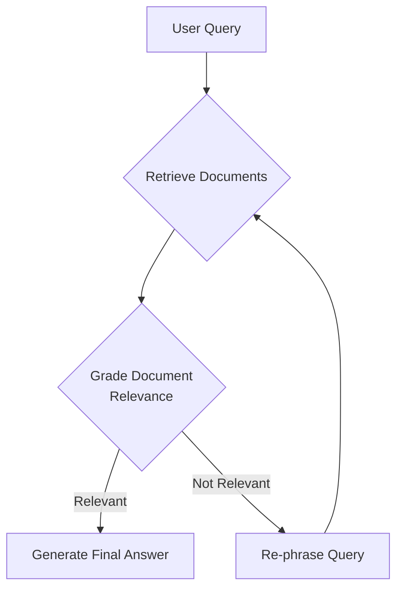
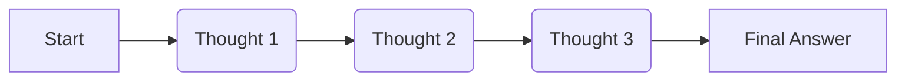
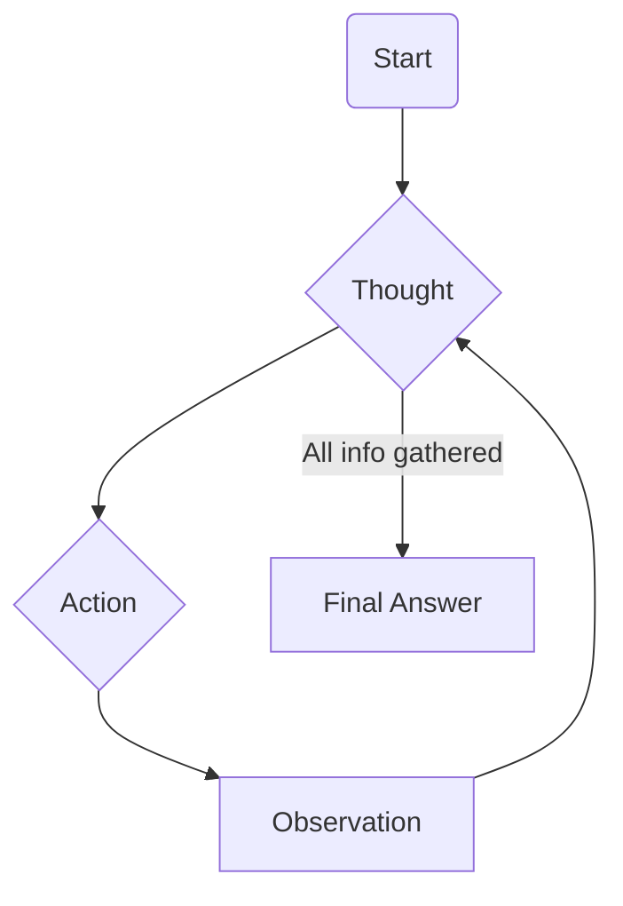
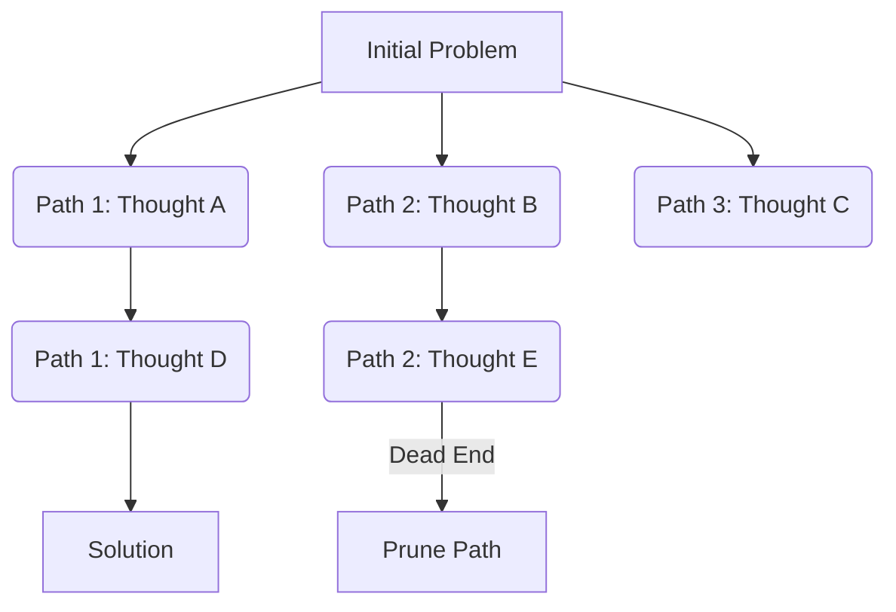
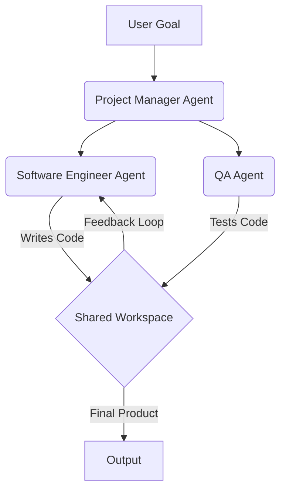
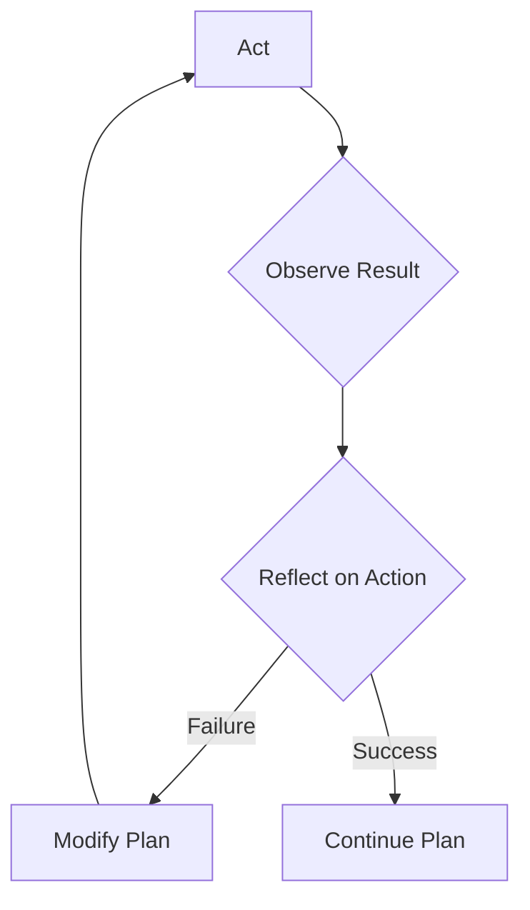
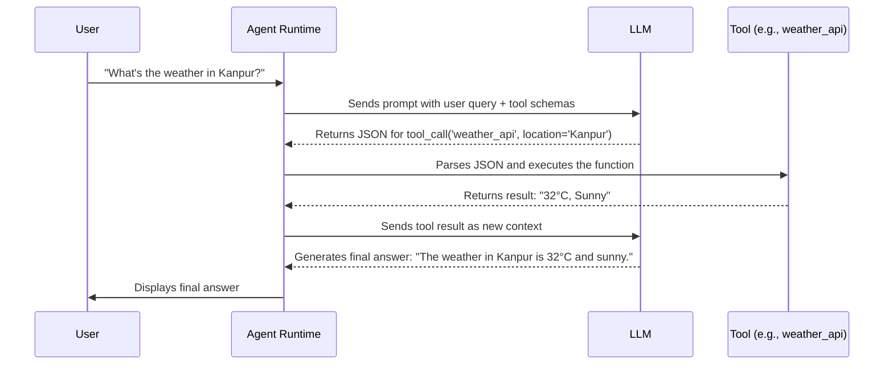

# Guide: RAG & Agentic AI

Large Language Models (LLMs) are extraordinary at generating natural, coherent text, but they face two big limitations: **stale knowledge** (they're trained on a frozen snapshot of the world) and **passivity** (they can't take action beyond answering in text).

To overcome the first limitation, the field introduced **Retrieval-Augmented Generation (RAG)**, a technique that equips LLMs with an open book of external knowledge. Instead of relying solely on what they were trained on, models can now pull in fresh, domain-specific, and reliable information before generating answers.

But while RAG makes models smarter, it doesn't make them active. This brings us to the second leap: **Agentic AI**. Unlike a static chatbot, an agent can set goals, use tools, reason step by step, access external systems, and autonomously act in the real world. If RAG was about giving models better memory, agents are about giving them hands, eyes, and initiative.

This guide starts with the foundations of RAG, explores advanced retrieval architectures, and then transitions into the design of AI agents - their brain, tools, memory, and reasoning patterns. 

By the end, you'll see how RAG and agents can be combined into Agentic RAG, where knowledge-rich systems don't just recall facts, but also reason, act, and solve problems autonomously.

## **Module Index**

| Module | Topic |
|:---:|---|
| **1** | **[Foundations: Why Retrieval-Augmented Generation (RAG)?](#id-1)** |
| **2** | **[The RAG Pipeline: A Step-by-Step Breakdown](#id-2)** |
| **3** | **[Advanced RAG Architectures & Techniques](#id-3)** |
| **4** | **[The Next Leap: Introduction to Agentic AI](#id-4)** |
| **5** | **[The Anatomy of an AI Agent (Brain, Tools, Memory)](#id-5)** |
| **6** | **[How Agents Think, Reason, and Act](#id-6)** |
| **7** | **[Tools Deep Dive: The Mechanics of Function Calling](#id-7)** |
| **8** | **[Advanced Memory Systems & Implementation](#id-8)** |
| **9** | **[Agentic RAG: Giving Your Agent Expert Knowledge](#id-9)** |
| **10**| **[Evaluation, Production Deployment & Safety](#id-10)** |

-----

<div id='id-1'/>
## **Module 1: Foundations: Why Retrieval-Augmented Generation (RAG)?**

### **The Problem: The LLM's "Snapshot" Memory**

Have you ever chatted with an LLM and asked about a very recent event, only to get an answer like, "I don't have information on events after my last update"? That's the LLM's closed knowledge cutoff in action.

Think of it this way: imagine you took a snapshot of the entire internet - all of Wikipedia, news articles, books, and websites - but you took it on a specific day, say, in early 2024. You then trained a supersmart AI on only that snapshot. The AI would be knowledgeable about everything up to that date.

But what if you asked it who won a major sporting event that just concluded? It wouldn't know. Its world is frozen in time. The Large Language Model (LLM) has no access to any new information created after its training was completed. It's working from a static, outdated internal memory. The LLM will most likely give an outdated answer or worse yet, "hallucinate" and answer with made-up facts.

### **The Solution: RAG**

Since we can't constantly retrain these massive models, we need a more efficient way to provide them with up-to-date, external information. The solution is to give the LLM an "open book" to consult before it answers. This technique is called **Retrieval-Augmented Generation (RAG)**.

RAG stands for **R**etrieval **A**ugmented **G**eneration.

  * **Retrieval:** The process of searching and finding relevant pieces of information from an external knowledge base.
  * **Augmented:** The user's original query is enhanced with the information that was just retrieved.
  * **Generation:** The LLM creates the final answer based on this new, *augmented prompt*.

This architecture allows the LLM to access domain-specific, private, and real-time information, reducing the chances of "hallucination" and even providing citations to make its answers more trustworthy.

#### **Dive Deeper**

  * **Reading:** [The paper that introduced RAG](https://arxiv.org/pdf/2005.11401) - The original academic paper that proposed the RAG framework.
  * **Reading:** [A great article on RAG by Pinecone](https://www.pinecone.io/learn/retrieval-augmented-generation/) - A practical, easy-to-understand guide to RAG concepts.

-----

<div id='id-2'/>
## **Module 2: The RAG Pipeline: A Step-by-Step Breakdown**

Now that we understand *why* RAG is necessary, let's dissect the process to understand how it's implemented. The entire workflow, from raw documents to a final answer, can be visualized as a two-stage process: an offline "Indexing" stage and an online "Retrieval & Generation" stage.

### **Step 1: Chunking**

We first break large documents into smaller, digestible pieces called **chunks**. This is necessary because LLMs have a fixed context window limit, and searching for a specific idea is more effective in focused paragraphs.

  * **Naive Chunking:** Simply splitting a document every 'x' characters. Fast but risky, as it can slice sentences in the middle.
  * **Smart Chunking:** Using logic to split documents along natural boundaries like paragraphs or section headings. This preserves the semantic meaning.

### **Step 2: Embeddings**

To understand the semantic meaning of our data, we convert the text chunks into **embeddings** - numerical vector representations of text. Chunks with similar meanings will have mathematically similar vectors. An embedding is like a digital fingerprint for meaning.

### **Step 3: Indexing & Vector Search**

We store these vectors in a specialized **Vector Database** (e.g., ChromaDB, FAISS, Pinecone). When you ask a question, the system converts it into a vector and uses the database to find the text chunks with the "closest" vectors. This process is called **Vector Search** or **"semantic search."**

### **Step 4: Retrieval**

This is the active search where we take a user's query vector and pull out the *top-k* most similar document chunks. The quality of this step is paramount - "Garbage in, garbage out."

### **Step 5: Augmentation & Generation**

Finally, we combine the retrieved text chunks with the original query to create a new, detailed prompt. The LLM receives this augmented prompt and generates an answer grounded in the facts we provided.

#### **Dive Deeper**

  * **Reading:** [Implement your first RAG in LangChain](https://medium.com/data-science/retrieval-augmented-generation-rag-from-theory-to-langchain-implementation-4e9bd5f6a4f2) - A practical walkthrough for building a basic RAG system.

-----

<div id='id-3'/>
## **Module 3: Advanced RAG Architectures & Techniques**

While the basic RAG pipeline works, it isn't always enough. Real-world data is messy and user queries can be vague. The following diagram provides a summary of various optimization techniques used to build more robust systems.

Let's explore some of these key strategies in more detail.


### **1. Query Enhancement**

If a user's query is too short or ambiguous (e.g., "memory in computers"), a simple search might fail to find the best documents. We can enhance the query first.

  * **Example: HyDE (Hypothetical Document Embeddings).** HyDE first uses an LLM to generate a *hypothetical answer* to the query. It then uses this detailed, hypothetical document to perform the vector search, which often finds more relevant results because the hypothetical answer is rich with contextual keywords.

### **2. Context Enrichment**

Sometimes, the way we chunk our documents can be improved to provide better context to the LLM.

  * **Example: Semantic Chunking.** Instead of splitting by a fixed size, you split documents based on semantic similarity. The system looks for "topic breaks" in the text, ensuring each chunk is focused and contextually complete.

### **3. Advanced Retrieval & Re-ranking**

The closest vector isn't always the most relevant document. To solve this, we can add a second, smarter filtering step.

  * **Example: Re-ranking.** This is a two-stage process. First, a fast vector search fetches many candidate documents (e.g., top 25). Then, a more powerful but slower **re-ranker model** inspects this smaller set and re-orders them based on their true relevance to the query.

### **4. Adaptive Retrieval (Self-Corrective RAG)**

Sometimes, a single retrieval cycle isn't enough. We can build a loop or graph that checks its own work. The system retrieves documents, uses an LLM to "grade" their relevance, and based on the grade, decides to either:

  * Generate an answer (if the docs are good).
  * Re-phrase the query and search again.
  * Search a different data source.

The following diagram illustrates this self-correcting loop:



#### **Dive Deeper**

  * **Reading:** [This GitHub repo](https://github.com/NirDiamant/RAG_Techniques) covers Advanced RAG techniques for beginners.
  * **Video:** [This video covers Advanced RAG](https://www.youtube.com/watch?v=sVcwVQRHIc8) implementations using LangChain and LangGraph.

-----

<div id='id-4'/>
## **Module 4: The Next Leap: Introduction to Agentic AI**

We've established that RAG gives LLMs access to external knowledge. However, the AI is still a passive conversationalist. It can *tell* you the weather based on a document, but it can't *check the live weather forecast* or *book you a ride* if it's raining.

To bridge the gap between knowing and doing, we introduce **Agentic AI**.

### **The Evolution to Autonomous Action**

  * **Traditional AI (The Rule-Based System):** Think of the first GPS devices that could calculate a route based on fixed rules and a static map. It could not see a live traffic jam or find available parking. It has no autonomy.
  * **Generative AI with RAG (The Knowledgeable Conversationalist):** Using ChatGPT with RAG, you can get a travel itinerary. But it's just text. It doesn't know real-time flight prices and cannot book the tickets for you. **You, the user, are still the one who has to act.**
  * **Agentic AI (The Autonomous Problem-Solver):** This is the paradigm where the AI crosses the boundary from passive conversationalist to active participant. An agent is given a high-level goal and the **tools** necessary to interact with real-world systems. It can then autonomously create and execute a plan to achieve that goal.

### **The Core Properties of an Agent**

Every true AI agent is defined by a set of core capabilities that enable its autonomous operation.

1.  **Goal-Orientation:** The agent's behavior is driven by a persistent objective. It maintains its goal (e.g., "book a flight") across multiple steps and tool calls.
2.  **Autonomy:** The agent can operate and make decisions without direct human intervention for every step. It runs its own reasoning loop - thinking, acting, observing - until it has a final answer.
3.  **Perception & Action (Tool Use):** Tools are the agent's senses and hands. A search API allows it to "perceive" the web. A code execution tool allows it to "act" by performing calculations.

#### **Dive Deeper**

  * **Reading:** [What is an AI agent? (IBM Research Blog)](https://www.ibm.com/think/topics/ai-agents#7281535) - A foundational definition of agentic systems.

-----

<div id='id-5'/>
## **Module 5: The Anatomy of an AI Agent (Brain, Tools, Memory)**

An agent is a system composed of several components. Thinking of it as having a brain, hands, and memory is useful.

### **Anatomy Part 1: The Brain (The LLM as a Reasoning Engine)**

The Large Language Model (LLM) is the cognitive core of an AI agent. At each step, it receives a carefully constructed prompt that acts as its "working memory," including:

  * The Overall Goal
  * Conversation History
  * Available Tools and their descriptions
  * The Result of the Last Action

Using this information, the LLM's primary task is to reason through the problem, break it down, and generate the precise text for the next action, which could be a final answer or a call to one of its tools.

### **Anatomy Part 2: The Hands & Eyes (Tools)**

Tools are the bridge between an agent's "brain" and the real world. They are simply functions that extend the agent's capabilities, allowing it to perceive its environment (e.g., search the web) and take concrete actions (e.g., send an email). We will do a much deeper dive into the technical mechanics of tools in Module 7.

### **Anatomy Part 3: Memory (A Brief Introduction)**

Memory allows an agent to maintain context and learn from past interactions, making it more efficient and personalized.

  * **Short-term Memory:** The current conversation context. This is handled automatically by passing the history of the interaction into the LLM's context window with each turn.
  * **Long-term Memory:** Persistent knowledge stored across sessions (e.g., remembering user preferences or facts learned from past tasks). This requires an external storage system, typically a Vector Database.

We will explore how to build and manage these memory systems in detail in Module 8.

#### **Dive Deeper**

  *   * **Reading:** [Memory in AI Agents](https://www.ibm.com/think/topics/ai-agent-memory) -What is AI agent memory?

-----

<div id='id-6'/>
## **Module 6: How Agents Think, Reason, and Act**

Understanding how agents reason is crucial to building effective systems. Agents use various reasoning patterns, from simple step-by-step thinking to complex collaborative problem-solving. Each pattern serves different purposes and can be combined for sophisticated cognitive architectures.

### **Reasoning Pattern 1: Chain-of-Thought (CoT)**

**What it is:** CoT is a prompting technique where the agent (LLM) is instructed to solve a task *step by step*, producing intermediate thoughts before arriving at a final answer.

**Why it matters:** It improves performance on multi-step problems that require arithmetic, commonsense, or logical reasoning. CoT mimics a more deliberate human thought process.

This process can be visualized as a simple, linear sequence:



**Example:**
Goal: "If I buy 3 apples at $0.50 each and 2 bananas at $0.75 each, what is the total cost?"

```
Thought 1: I need to calculate the cost of the apples first. 3 apples * $0.50/apple = $1.50.
Thought 2: Next, I need to calculate the cost of the bananas. 2 bananas * $0.75/banana = $1.50.
Thought 3: Finally, I need to add the two costs together. $1.50 + $1.50 = $3.00.
Final Answer: The total cost is $3.00.
```

#### **Dive Deeper**

  * **Reading:** [Chain-of-Thought Prompting Paper (arXiv:2201.11903)](https://arxiv.org/abs/2201.11903) - The original paper that introduced CoT reasoning.

### **Reasoning Pattern 2: ReAct (Reason + Act)**

**What it is:** ReAct is a framework that interleaves reasoning and actions in a loop. At each step, the agent generates a "Thought," then chooses to perform an "Action" (using a tool), and then observes the "Observation" (the tool's output).

**Why it matters:** ReAct is the fundamental pattern for tool-using agents. It allows them to interact with the external world to gather information or perform tasks, and then use the results of those actions to inform their next thought.

The ReAct framework follows a cyclical pattern:



**Example:**
Goal: "What was the weather like in Kanpur yesterday?"

```
Thought: I need to find historical weather data for Kanpur. The user said "yesterday," so I need today's date. Let's assume today is September 15th, 2025. I have a `weather_api` tool that can fetch this.
Action: weather_api[{"location": "Kanpur, UP", "date": "2025-09-14"}]
Observation: {"high": "34°C", "low": "28°C", "condition": "Partly cloudy"}
Thought: I successfully retrieved the weather data. The high was 34°C, the low was 28°C, and the condition was partly cloudy. I now have enough information to answer the user's question.
Final Answer: The weather in Kanpur yesterday (September 14, 2025) had a high of 34°C, a low of 28°C, and was partly cloudy.
```

#### **Dive Deeper**

  * **Reading:** [The ReAct Paper (arXiv:2210.03629)](https://arxiv.org/abs/2210.03629) - The original academic paper that introduced the framework.

### **Reasoning Pattern 3: Tree of Thoughts (ToT)**

**What it is:** Instead of following a single linear chain of thought, the agent explores **multiple reasoning paths** simultaneously, forming a "tree." It can evaluate the progress along different branches and backtrack from dead ends.

**Why it matters:** This is useful for complex problems where one wrong step early on can derail the entire process. ToT allows for more robust planning and problem-solving by considering multiple possibilities in parallel.

This pattern can be visualized as a branching and pruning process:



**Example:** Planning a weekend trip

```
Path 1: Visit Museum → Lunch → Park → Dinner
 - Evaluation: Good for a rainy day, but the park might be less enjoyable.

Path 2: Hiking → Lunch → Visit Market → Dinner
 - Evaluation: Great for a sunny day, but high energy. Risky if weather is bad.

Path 3: Visit Market → Cooking Class (Lunch) → Museum
 - Evaluation: Balanced option, less weather-dependent.

Decision: Based on the weather forecast, the agent will choose the most promising path. If it's sunny, it proceeds with Path 2.
```

#### **Dive Deeper**

  * **Reading:** [Tree of Thoughts Paper (arXiv:2305.10601)](https://arxiv.org/abs/2305.10601) - The foundational research on branching reasoning.

### **Reasoning Pattern 4: Multi-Agent Systems (MAS)**

**What it is:** Instead of one agent solving a problem, complex tasks are divided among a team of **specialized agents** that collaborate. Each agent has a specific role and communicates its results to the others.

**Why it matters:** This mirrors effective human organizations. It reduces the cognitive load on any single agent, enables tasks to be parallelized, and can lead to higher-quality outcomes through specialization and debate.

The workflow often resembles a structured team collaboration:



**MetaGPT**

 MetaGPT simulates an entire software company with agents playing roles like Project Manager, Architect, and Engineer. 

  * **Project Manager Agent:** Decomposes the goal into detailed tasks and file specifications.
  * **Software Engineer Agent:** Receives file specs and writes clean, functional Python code.
  * **QA Agent:** Tests the code, identifies bugs, and provides specific feedback.

These agents communicate through a shared workspace, passing artifacts and feedback until the complete project is finished.

#### **Dive Deeper**

  * **Reading:** [AutoGen: Enabling Next-Gen LLM Applications (Microsoft Research)](https://microsoft.github.io/autogen/docs/tutorial/introduction) - An introduction to a popular multi-agent framework.
  * **Reading:** [MetaGPT GitHub Repository](https://github.com/geekan/MetaGPT) - Explore the implementation of a "software company" powered by multi-agent collaboration.

### **Reasoning Pattern 5: Reflexion & Self-Correction**

**What it is:** The agent **reviews its past actions and reasoning**, identifies mistakes, and adjusts its future strategy based on failures and feedback. It learns from its own experience within a single task.

**Why it matters:** This enables iterative improvement without needing to be retrained. It is critical for long-horizon tasks or situations where tools might fail, requiring the agent to adapt its approach.

The Reflexion process is a loop of action and self-critique:



**Example Workflow:**

```
Attempt 1:
 Action: weather_api[{"location": "Kanpur", "date": "yesterday"}]
 Result: Error - "Invalid date format. Please use YYYY-MM-DD."

Reflection (Self-Critique): "The API call failed. The error message indicates that the API expects a specific date format like 'YYYY-MM-DD', not relative terms like 'yesterday'. I must correct my input."

Attempt 2:
 Action: weather_api[{"location": "Kanpur", "date": "2025-09-14"}]
 Result: Success - Weather data retrieved.

Learning: "For future calls to this tool, I will always convert relative dates into the YYYY-MM-DD format."
```

#### **Dive Deeper**

  * **Reading:** [Reflexion: Language Agents with Verbal Reinforcement Learning (arXiv:2303.11366)](https://arxiv.org/abs/2303.11366) - The research on self-improving agents.

-----

<div id='id-7'/>
## **Module 7: Tools Deep Dive: The Mechanics of Function Calling**

Now that we understand how agents reason, let's explore the core mechanism that allows them to act: **Tools**. Before an agent can use a tool, it needs a "user manual." An LLM can't read Python code directly, so we must provide it with a clear, structured description of what a tool does, what inputs it needs, and what format to use. This process is called **Function Calling** or **Tool Use**.

This sequence diagram illustrates the entire lifecycle of a tool call, from the user's query to the final answer.



### **The Five Steps of a Tool Call**

Let's break down the technical process shown in the diagram into five steps.

#### **Step 1: Define the Tool in Python**

Everything starts with a standard Python function. Notice the type hints (`str`) and the docstring; these are crucial for the next step.

```python
def get_weather(location: str, unit: str = "celsius") -> str:
    """Get current weather for a specific location."""
    # ... implementation to call a real weather API ...
    # For this example, we'll return a fixed value.
    return "32°C, Sunny"
```

#### **Step 2: Create the "User Manual" (The JSON Schema)**

This is the most critical step. We convert the Python function into a structured JSON format that the LLM is trained to understand. Think of it as translating our Python tool into the LLM's native language.

  * **`name`**: The exact name the LLM must use to call the tool.
  * **`description`**: The most important part. The LLM uses this to decide *when* to use the tool. **Good descriptions are key to reliable agents.**
  * **`parameters`**: Describes the function's arguments (`location` and `unit`), their types (`string`), and which are required.

Frameworks like LangChain can do this translation automatically, but understanding the underlying schema is key. The Python function is translated into this "manual" for the LLM:

```json
{
    "name": "get_weather",
    "description": "Get current weather for a specific location.",
    "parameters": {
        "type": "object",
        "properties": {
            "location": {
                "type": "string",
                "description": "The city and state, e.g., San Francisco, CA"
            },
            "unit": {"type": "string", "enum": ["celsius", "fahrenheit"]}
        },
        "required": ["location"]
    }
}
```

#### **Step 3: Show the Manual to the LLM**

The Agent Runtime takes this JSON schema and injects it into the system prompt it sends to the LLM. The prompt now says: "Solve the user's goal. By the way, you have a tool available called `get_weather`. Here's its manual."

#### **Step 4: The LLM Decides to Use the Tool**

When the user asks, "What's the weather in Kanpur?", the LLM reads the prompt, sees that the `get_weather` tool is perfect for this (based on its description), and generates a special formatted output. It does **not** run the function itself; it just tells the Agent Runtime what it *wants* to run.

#### **Step 5: The Runtime Executes the Tool and Reports Back**

The Agent Runtime sees the tool call, parses it, and calls the actual `get_weather` Python function with the provided arguments. The function returns `"32°C, Sunny"`. The runtime then passes this result back to the LLM as new context, saying: "I did what you asked. The result of calling `get_weather` was '32°C, Sunny'." The LLM then uses this information to generate the final, human-readable answer.

### **Tool Calling Frameworks Comparison**

While you can build this system from scratch, most developers use a framework to handle the complexities of schema generation, prompt management, and response parsing.

| Framework | Tool Definition | Pros | Cons |
|---|---|---|---|
| **OpenAI Function Calling**| JSON schema in API call | Fast, reliable, native | Vendor lock-in |
| **LangChain Tools** | Python decorators (`@tool`)| Easy, framework-agnostic, many pre-builts | Extra abstraction layer |
| **Anthropic Tool Use** | XML-based schema | Structured output | Limited model support |
| **Custom Implementation** | Manual prompt engineering | Full control | More development work |

### **Assignment: Build Your First Agent**

The best way to understand agents is to build one. Let's create a simple research agent that can search the web.

**1. Set up your environment and choose a framework.**
Agent development is accelerated by frameworks that handle the complexities of prompt formatting, tool management, and state tracking.

  * **[LangChain](https://python.langchain.com/docs/get_started/introduction):** A popular, versatile framework. It has a vast library of integrations and is good for rapid prototyping. For complex, stateful agents, its extension **[LangGraph](https://langchain-ai.github.io/langgraph/)** allows you to define agent workflows as graphs.
  * **[LlamaIndex](https://www.llamaindex.ai/):** While it started with a focus on RAG, LlamaIndex has agent capabilities. It often provides more structured, data-centric building blocks for agents that interact heavily with data sources.

For this assignment, we'll use LangChain as an example. You'll need an API key from a provider like OpenAI and a search tool provider like Tavily.

**2. Define your tools.**
A research agent needs a search tool. We can use a pre-built one.

```python
from langchain_community.tools.tavily_search import TavilySearchResults

# The only tool our agent will have is the Tavily search tool
tools = [TavilySearchResults(max_results=1)]
```

**3. Create the agent.**
We'll use a pre-built agent "constructor" from LangChain. This function bundles the LLM, the tools, and a pre-designed prompt (based on ReAct) into a runnable agent.

```python
from langchain_openai import ChatOpenAI
from langchain import hub
from langchain.agents import create_openai_tools_agent, AgentExecutor

# Get a prompt template
prompt = hub.pull("hwchase17/openai-tools-agent")

# Choose the LLM
llm = ChatOpenAI(model="gpt-3.5-turbo-1106", temperature=0)

# Create the agent by binding the tools to the LLM
agent = create_openai_tools_agent(llm, tools, prompt)

# Create the Agent Executor, which is the runtime for the agent
agent_executor = AgentExecutor(agent=agent, tools=tools, verbose=True)
```

**4. Run your agent\!**
Now, you can invoke the agent with a goal. The `verbose=True` flag will show you its reasoning process (its Chain-of-Thought and ReAct loop).

```python
agent_executor.invoke({"input": "Who is the current Prime Minister of India?"})
```

**5. Observe and Debug.**
As you build, you'll realize that seeing the agent's internal reasoning is crucial. This is where observability tools are non-negotiable. **[LangSmith](https://www.langchain.com/langsmith)** allows you to trace every step of your agent's execution - every LLM call, every tool input/output - making it indispensable for debugging and evaluation.

### **Tool Usage Examples and Links**

When giving your agent tools, here are some practical resources:

  * **Web Search:**
      * [Tavily Search API](https://docs.tavily.com/documentation/about): Advanced search great for research agents.
      * [SerpAPI](https://serpapi.com/search-api): A wrapper for Google Search results.
  * **Databases:**
      * [SQL Agent with LangChain](https://python.langchain.com/docs/tutorials/sql_qa/): Allow agents to query SQL databases with natural language.
  * **Code Execution:**
      * [Safe Code Execution with LangGraph](https://blog.langchain.dev/code-execution-with-langgraph/): A guide to building secure code execution tools.

#### **Dive Deeper**

  * **Reading:** [Function Calling and Other Structured Outputs (OpenAI Cookbook)](https://cookbook.openai.com/examples/how_to_call_functions_with_chat_models) - A technical look at how LLMs produce formatted tool calls.

-----

<div id='id-8'/>
## **Module 8: Advanced Memory Systems & Implementation**

We briefly introduced memory in Module 5. Now, let's explore how to implement a persistent memory that allows an agent to learn across conversations.


### Short-Term Memory: The Agent's Working Context
This is the agent's active, working memory, like RAM in a computer. It holds the immediate context of the current task. This entire conversational history is passed back to the LLM with each turn, but it's limited by the context window size and is forgotten once the session ends.

### Long-Term Memory: The Agent's Persistent Knowledge Store
This is the agent's permanent knowledge base, like a hard drive. It allows the agent to retain information across multiple sessions. The most common implementation is through a **Vector Database**.

1.  **Ingestion:** When a piece of information should be remembered (e.g., a user preference), the text is converted into a vector embedding.
2.  **Storage:** The vector is stored in a vector database with associated metadata (e.g., `user_id`, `timestamp`).
3.  **Retrieval:** To recall information, the agent's current query is embedded. The vector database performs a similarity search to find the most relevant stored memories. These are then fed back into the agent's prompt to inform its next action.
**Long-Term Memory: The Agent's Persistent Knowledge Store**
**Function**: This is the agent's permanent knowledge base, analogous to a hard drive. It allows the agent to retain and recall information across multiple sessions, leading to more personalized and intelligent interactions over time.

**Types of Long-Term Memory**
To create more sophisticated and human-like AI agents, long-term memory can be further categorized, mirroring the distinctions made in human cognitive psychology:

* **Episodic Memory:** This allows the agent to recall specific past events and experiences. For example, an AI agent could remember a user's previous requests and the solutions that were provided, enabling it to offer more personalized and effective assistance in the future.

* **Semantic Memory:** This stores general factual knowledge about the world, such as definitions, concepts, and relationships. An AI legal assistant, for instance, would use its semantic memory to access and reason with a vast knowledge base of case law and legal statutes.

* **Procedural Memory:** This is the memory of how to perform specific tasks or skills. Through reinforcement learning and repeated practice, an AI agent can develop procedural memory for complex workflows, allowing it to execute them efficiently and automatically without needing to reason through each step every time.

By combining these different memory systems, AI agents can achieve a much higher level of intelligence, adaptability, and personalization, making them more powerful and effective tools for a wide range of applications.

### **Introducing Mem0: A Memory-as-a-Service Layer**

Implementing a robust memory system from scratch can be complex. **Mem0** is an open-source library designed to provide an intelligent, self-correcting memory layer for AI agents. Instead of just storing raw text, Mem0 can use an LLM to process, summarize, and organize information automatically.

  * **Integration Example:**
    Here's how you might use Mem0 to give your agent a long-term memory.

```python
from mem0 import Memory

# Initialize Mem0
memory = Memory(config={
    "vector_store": {"provider": "chroma", "config": {"path": "./memories"}},
    "llm": {"provider": "openai", "config": {"model": "gpt-4o-mini"}}  # specify model
})

user_id = "user_123"

# Add memories
memory.add("The user's favorite color is blue.", user_id=user_id)
memory.add("The user is working on a project named 'Project Phoenix'.", user_id=user_id)

# Search relevant memories
relevant_memories = memory.search(
    query="What are the key details about this user?",
    user_id=user_id
)

for mem in relevant_memories:
    print(mem["text"], "| score:", mem["score"])

```

You can then wrap these `memory.add` and `memory.search` functions as tools for your agent, allowing it to explicitly save and retrieve information.

#### **Dive Deeper**

  * **Reading:** [Mem0 GitHub Repository](https://github.com/mem0ai/mem0) - Explore the library, its features, and how to integrate it into your projects.

-----

<div id='id-9'/>
## **Module 9: Agentic RAG: Giving Your Agent Expert Knowledge**

We've covered RAG and we've covered Agents. Now, let's combine them. Agentic RAG is a paradigm where agents don't just passively receive information but intelligently interact with knowledge bases to solve complex problems.

### **The Foundation - RAG as a Tool**

The most direct way to empower your agent is to provide its RAG pipeline as a custom `Tool`. The agent's LLM brain doesn't need to know about vector databases or chunking; it only needs a tool for answering questions from a specific knowledge set.

```python
def search_internal_wiki(query: str) -> str:
    """
    Use this tool to find information about internal company processes,
    engineering best practices, and project histories from our Confluence wiki.
    Input should be a clear, specific question.
    """
    # ... Your entire RAG pipeline logic (embed, search, synthesize) happens here ...
    return retrieved_answer
```

Now, the agent can reason about *where* to look for an answer.

  * For "What's the weather like?", it will choose a web search tool.
  * For "What is our deployment process?", it will choose `search_internal_wiki`.

This separates the agent's **reasoning** from its **knowledge retrieval**.

### **The Intelligent Router - Choosing the Right Knowledge**

An advanced agent often has access to *multiple* specialized knowledge bases (e.g., product manuals, past support tickets, a CRM database). In this scenario, the agent's primary role becomes that of an **intelligent router**, analyzing the user's query and routing it to the most appropriate tool or sequence of tools.

**Example: A Multi-Source Research Agent**
Query: *"Summarize our Q3 user study findings and compare them to recent industry trends."*

The agent's reasoning would be:

1.  **Decomposition:** "This query has two parts: internal study results and public industry trends."
2.  **Action 1 (Internal):** "I will use my `search_user_research_db` tool for the Q3 findings."
3.  **Action 2 (External):** "I will use my `tavily_web_search` tool for recent industry trends."
4.  **Synthesis:** "I have both pieces of information. I will now synthesize them into a final comparative summary."

### **The Active Researcher - Agent-Driven Retrieval**

This is the frontier of Agentic RAG. Instead of just *calling* a RAG pipeline, the agent *becomes* the pipeline. The agent is given granular tools that allow it to actively control the retrieval process itself.

Its toolset might include:

  * `expand_query(question)`: Generates alternative questions to improve search.
  * `retrieve_chunks(query)`: Performs the core vector search.
  * `rerank_chunks(chunks, question)`: Re-orders chunks for relevance.
  * `check_chunk_relevance(chunk, question)`: Uses the LLM to decide if a chunk is truly useful.

This architecture creates resilient agents that can tackle ambiguous research tasks, mimicking a human researcher who digs, filters, and synthesizes until confident in the answer.

#### **Dive Deeper**

  * **Reading:** [Building an Agentic RAG with LangGraph](https://medium.com/@wendell_89912/building-an-agentic-rag-with-langgraph-a-step-by-step-guide-009c5f0cce0a) - Learn how to orchestrate an adaptive retrieval workflow.
  * **Reading:** [Self-RAG (arXiv:2310.11511)](https://arxiv.org/abs/2310.11511) - The research paper detailing an advanced architecture for adaptive retrieval.

-----

<div id='id-10'/>
## **Module 10: Evaluation, Production Deployment & Safety**

Building a working agent is only the beginning. To create a reliable and responsible application, you must focus on evaluation, deployment, and safety.

### **Observability**

You cannot fix what you cannot see. The non-deterministic nature of LLMs means you **must** be able to inspect the full reasoning chain of your agent to understand failures. Using a tracing and debugging platform like **LangSmith** from the beginning of your project is non-negotiable for any serious application.

### **Evaluation**

To know if your agent is improving, you must evaluate it systematically. This involves creating a test suite of questions and measuring performance.

  * **Outcome-based Evaluation:** Did the agent produce the correct final answer? This is simple to measure but can be misleading.
  * **Trajectory-based Evaluation:** Did the agent follow the correct reasoning steps and use the right tools in the right order? This is better for debugging the agent's logic.
  * **Evaluation in Practice:** Create a "golden dataset" of inputs and expected outputs/trajectories. Run your agent against this dataset to track regressions and improvements as you make changes.

### **Production Deployment Considerations**

  * **Scalability:** Implement rate limiting for APIs, cache expensive operations (like embeddings), and use load balancing to distribute requests.
  * **Infrastructure:** Use containerization (Docker) and orchestration (Kubernetes) for consistent and scalable deployments.
  * **Security:** Manage API keys securely, implement network security, and encrypt sensitive data.

### **Safety & Guardrails**

An autonomous agent with access to tools carries risks. Implementing robust safety guardrails is a critical part of responsible development.

  * **Input Guardrails:** Sanitize and validate all user input to prevent prompt injection, where a user might try to trick the agent into executing harmful instructions.
  * **Output Guardrails:** Parse the LLM's output to ensure it is a valid, well-formed tool call. Reject any output that looks like malicious code or an unintended action.
  * **Tool Guardrails:**
      * **Sandboxing:** Any tool that executes code (e.g., a Python interpreter) MUST run in a sandboxed environment (like a Docker container) to prevent it from accessing the host system.
      * **Rate Limiting & Budgeting:** Implement strict limits on how many times an agent can call a tool (especially paid APIs) to control costs and prevent runaway loops.
      * **The Final Safeguard: Human-in-the-Loop:** For any sensitive action (e.g., sending an email, modifying a database), the agent should pause and require explicit approval from a human user before proceeding.

#### **Dive Deeper**

  * **Reading:** [Evaluating Agents (LangChain Docs)](https://docs.langchain.com/langsmith/evaluate-complex-agent) - Practical guides on setting up agent evaluation.

## **Final Note: Your Journey Into Agentic AI**

Agentic AI is evolving at a rapid pace. The concepts in this guide provide a solid foundation, but the field will continue advancing. Here's how to stay current:

  * **Read Research:** Follow developments on arXiv and at major AI conferences.
  * **Keep Building:** The best way to learn is by doing. Start with simple tool-using agents and gradually add complexity like memory and advanced RAG.
  * **Join Communities:** Engage with other developers on platforms like Discord, GitHub, and Reddit.

The future of AI is agentic. **Happy Building!**

**Contributors**

- Taran Mohta \| +91 7977152322
- Priyanshu Ranjan \| +91 7339894751